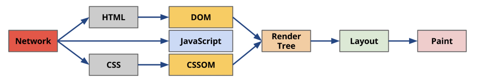

### BOM相关问题

#### HTML5新特性及API

新增了关于图像，位置，存储，多任务等API。

* 拖拽释放(Drag and drop) API   
* 语义化标签（`header,nav,footer,aside,article,section`）  
* 音频、视频API(audio,video)  
* 画布(Canvas) API  地理(Geolocation) API  
* 本地离线存储   localStorage 长期存储数据，浏览器关闭后数据不丢失；  sessionStorage 的数据在浏览器关闭后自动删除 
* 表单控件，calendar、date、time、email、url、search    
* 新的技术 webworker, websocket, Geolocation等

web worker是运行在浏览器后台的js程序，他不影响主程序的运行，是另开的一个js线程，可以用这个线程执行复杂的数据操作，然后把操作结果通过postMessage传递给主线程，这样在进行复杂且耗时的操作时就不会阻塞主线程了。

---

#### BOM中有哪些对象

问题比较大哈

---

#### 浏览器内核

- IE：Triden，Trident与W3C标准基本脱节，造成IE的兼容性难题。
- Firefox：Gecko，基本只用于Firefox浏览器
- Chrome/Opera：Blink内核，Blink是Google在Webkit基础上开发的开源内核，Chrome最初是基于Webkit的，后来越来越觉得Webkit过于保守，因此单独拉取了Blink分支。Blink在多进程架构，JavaScript引擎方面都与Webkit有比较大的差别。但二者都是遵守W3C标准的，因此开发者不用考虑二者兼容性问题。
- Safari：Webkit，苹果开发的浏览器内核，并于2005年开放源代码。Chrome的Blink也是基于Webkit开发的，差异性不是特别大，也可以认为是Webkit内核浏览器。
- 移动端：ios和Android 4.4以前平台使用Webkit内核，Android4.4及以后版本使用Blink。

---

#### 浏览器渲染原理

### 浏览器渲染原理解析

1. 首先渲染引擎下载HTML，解析生成DOM Tree
2. 遇到css标签或JS脚本标签就新起线程去下载他们，并继续构建DOM。（其中css是异步下载同步执行）浏览器引擎通过 DOM Tree 和 CSS Rule Tree 构建 Rendering Tree
3. 通过 CSS Rule Tree 匹配 DOM Tree 进行定位坐标和大小，这个过程称为 Flow 或 Layout 。
4. 最终通过调用Native GUI 的 API 绘制网页画面的过程称为 Paint 。

当用户在浏览网页时进行交互或通过 js 脚本改变页面结构时，以上的部分操作有可能重复运行，此过程称为 Repaint 或 Reflow。 重排是指dom树发生结构变化后，需要重新构建dom结构。 重绘是指dom节点样式改变，重新绘制。 重排一定会带来重绘，重绘不一定有重排。

如何减少浏览器重排：将需要多次重排的元素，position属性设为absolute或fixed，这样此元素就脱离了文档流，它的变化不会影响到其他元素。

---

#### 页面可见性（Page Visibility API） 可以有哪些用途？

  通过 visibilityState 的值检测页面当前是否可见，以及打开网页的时间等;
  在页面被切换到其他后台进程的时候，自动暂停音乐或视频的播放；

---

#### 参考

[^1]: https://github.com/markyun/My-blog/tree/master/Front-end-Developer-Questions/Questions-and-Answers

