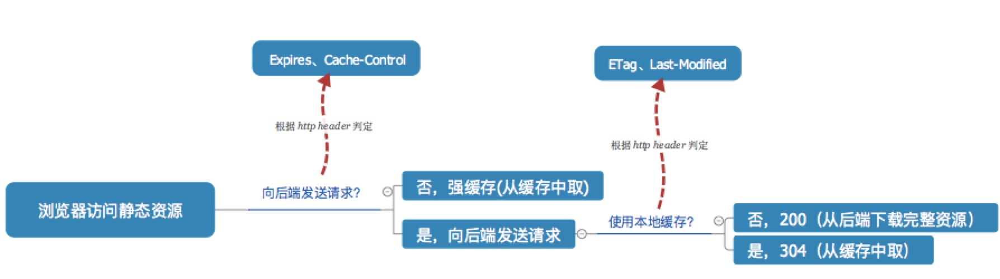

### 缓存相关问题

#### Cookie相关

```
Set-Cookie: value[; expires=date][; domain=domain][; path=path][; secure]
```

如果想让cookie存在一段时间，就要为expires属性设置为未来的一个用毫秒数表示的过期日期或时间点，expires默认为设置的expires的当前时间。现在已经被max-age属性所取代，max-age用秒来设置cookie的生存期。如果max-age为0，则表示删除该cookie。

cookie的属性：

- HttpOnly属性告之浏览器该 cookie 绝不能通过 JavaScript 的 `document.cookie` 属性访问。
- domain属性可以使多个web服务器共享cookie。
- 只有path属性匹配向服务器发送的路径，Cookie 才会发送。必须是绝对路径
- secure属性用来指定Cookie只能在加密协议HTTPS下发送到服务器。
- max-age属性用来指定Cookie有效期
- expires属性用于指定Cookie过期时间。它的格式采用Date.toUTCString()的格式。

浏览器的同源政策规定，两个网址只要域名相同和端口相同，就可以共享Cookie。

1.浏览器输入 url 之后敲下回车，刷新 F5 与强制刷新(Ctrl + F5)，又有什么区别？

实际上浏览器输入 url 之后敲下回车就是先看本地 cache-control、expires 的情况，刷新(F5)就是忽略先看本地 cache-control、expires 的情况，带上条件 If-None-Match、If-Modified-Since，强制刷新(Ctrl + F5)就是不带条件的访问。

2.etag，cache-control，last-modified

如果比较粗的说先后顺序应该是这样：

- Cache-Control —— 请求服务器之前
- Expires —— 请求服务器之前
- If-None-Match (Etag) —— 请求服务器
- If-Modified-Since (Last-Modified) —— 请求服务器

需要注意的是 如果同时有 etag 和 last-modified 存在，在发送请求的时候会一次性的发送给服务器，没有优先级，服务器会比较这两个信息.

如果expires和cache-control:max-age同时存在，expires会被cache-control 覆盖。

其中Expires和cache-control属于强缓存，last-modified和etag属于协商缓存 强缓存与协商缓存区别：强缓存不发请求到服务器，协商缓存会发请求到服务器。




---

#### 缓存，存储相关（cookie，web storage和session）

cookie优点： 1.可以解决HTTP无状态的问题，与服务器进行交互 缺点： 1.数量和长度限制，每个域名最多20条，每个cookie长度不能超过4kb 2.安全性问题。容易被人拦截 3.浪费带宽，每次请求新页面，cookie都会被发送过去

#### cookie和session区别

1.cookie数据存放在客户的浏览器上，session数据放在服务器上。 2.session会在一定时间内保存在服务器上。当访问增多，会比较占用你服务器的性能。考虑到减轻服务器性能方面，应当使用COOKIE。

sessionStorage是当前对话的缓存，浏览器窗口关闭即消失，localStorage持久存在，除非清除浏览器缓存。

#### 页面缓存原理

页面缓存状态是由http header决定的，一个浏览器请求信息，一个是服务器响应信息。主要包括Pragma: no-cache、Cache-Control、 Expires、 Last-Modified、If-Modified-Since。

---