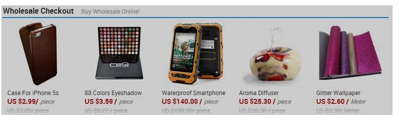

### DOM相关问题

因为JS包含的内容很广泛，放在一个章节里肯定是不够的。所以单独罗列了DOM问题和BOM问题出来。

### DOM元素

#### DOM元素的操作方法

1）创建新节点

createDocumentFragment()    //创建一个DOM片段

createElement()   //创建一个具体的元素

createTextNode()   //创建一个文本节点

2）添加、移除、替换、插入

appendChild()      //添加

removeChild()      //移除

replaceChild()      //替换

insertBefore()      //插入

3）查找

getElementsByTagName()    //通过标签名称

getElementsByName()     //通过元素的Name属性的值

getElementById()        //通过元素Id，唯一性

#### DOM节点的查询

- `getElementById` // 通过id查询单个节点
- `getElementsByClassName` //查询类，返回节点集合
- `getElementsByTagName` //查询标签，返回节点集合
- `querySelector`//选择器查询，返回第一个匹配节点
- `querySelectorAll` //返回深度优先搜索的节点集合


- `getElementsByName` //只有 HTMLDocument 类型才有的方法，返回带有给定 name 特性的元素集合
- `getElementsByTagNameNS` //在给定命名空间中查询标签，返回节点集合

#### 如何使用CSS选择器提升节点查询速度

依赖于选择哪项元素，`getElmentById` 是速度最快的， 但`id`不能滥用；`getElementsByClassName` 其次。

查询速度依次下降：

- ID (#myID)
- Class (.myClass)
- Tag (div, p)
- Sibling (div+p, div~p)
- child (div>p)
- Descendant (div p)
- Universal (*)
- Attribute (input[type="checkbox"])
- Pseudo (p:first-child)

#### DOM元素属性操作

#### DOM元素e的e.getAttribute(propName)和e.propName有什么区别和联系

- e.getAttribute()，是标准DOM操作文档元素属性的方法，具有通用性可在任意文档上使用，返回元素在源文件中**设置的属性**
- e.propName通常是在HTML文档中访问特定元素的**特性**，浏览器解析元素后生成对应对象（如a标签生成HTMLAnchorElement），这些对象的特性会根据特定规则结合属性设置得到，对于没有对应特性的属性，只能使用getAttribute进行访问
- e.getAttribute()返回值是源文件中设置的值，类型是字符串或者null（有的实现返回""）
- e.propName返回值可能是字符串、布尔值、对象、undefined等
- 大部分attribute与property是一一对应关系，修改其中一个会影响另一个，如id，title等属性
- 一些布尔属性`<input hidden/>`的检测设置需要hasAttribute和removeAttribute来完成，或者设置对应property
- 像`<a href="../index.html">link</a>`中href属性，转换成property的时候需要通过转换得到完整URL
- 一些attribute和property不是一一对应如：form控件中`<input value="hello"/>`对应的是defaultValue，修改或设置value property修改的是控件当前值，setAttribute修改value属性不会改变value property

#### "attribute" 和 "property" 的区别是什么？

attribute是DOM对象上的属性

property是JS对象上的属性，更为通用的概念

#### DOM元素的类型判断

#### window 与 document的关系与区别

window是JS在浏览器宿主下的全局对象，包括一些全局函数、location、history、setTimeout、console、localStorage等。

document是window对象的一个属性，表示文档对象，页面的元素、节点都在文档对象下。

```javascript
window.document === document; //true
window.getElementById; //undefined
document.getElementById; //function getElementById() { [native code] }    
```

#### 元素添加类

```javascript
function addClass(selector, className){
  var elm = document.querySelector(selector);
  if (elm){
    elm.classList.add(className);
  }
}     
```

移除类／切换类／是否包含类

```javascript
//IE9+
el.classList.remove('my-class'); //removing a class
el.classList.toggle('my-class');  // toggling a class
el.classList.contains('my-class'); // checking whether class exists
        
```

#### 判断是否后代元素

```javascript
function isDescendant(parent, child){ 
  while(child.parentNode ){ 
    if(child.parentNode == parent)
      return true;
    else
      child = child.parentNode;
  }
  return false;
}
```

#### innerHTML 与appendChild

使用`innerHTML`，浏览器会移除节点的所有内容后将字符串解析成html加载到子元素里


```javascript
var ul = document.getElementById('myList');
el.innerHTML = '<li>Only one item</li>';              
```

`innerHTML`要解析字符串所以效率不高

`appendChild`创建新元素后加载到父元素的尾部，效率更高。如果将已存在的DOM对象添加到父元素，该对象原来的位置会被移除。

```javascript
var li = document.createElement("li");
var text = document.createTextNode('Only one Item');
li.appendChild(text);
ul.appendChild(li);    
```

#### CrateDocumentFragment

***`documentFragment`，文档片段是轻量级的文档对象，在批量操作DOM时比较有用，节省浏览器反复渲染的时间。 

```javascript
//bad practice. you are hitting the DOM every single time
var list = ['foo', 'bar', 'baz', ... ],
    el, text;
for (var i = 0; i < list.length; i++) {
    el = document.createElement('li');
    text = document.createTextNode(list[i]);
    el.appendChild(text);
    document.body.appendChild(el);
}     
```

```javascript
//good practice. you causing reflow one time
var fragment = document.createDocumentFragment(),
    list = ['foo', 'bar', 'baz', ...],
    el, text;
for (var i = 0; i < list.length; i++) {
    el = document.createElement('li');
    text = document.createTextNode(list[i]);
    el.appendChild(text);
    fragment.appendChild(el);
}
document.body.appendChild(fragment);
```

#### 获取页面中的所有文本

1. 最简单

```javascript
document.body.innerText;
```

1. 通过查询节点获取

```javascript
function getAllText(node){
  var allText = [];
  function getNodeText(node){
    if(node && node.childNodes && node.childNodes.length){
      for(var i = 0, len = node.childNodes.length; i<len; i++){
        getNodeText(node.childNodes[i]);
      }
    }
    else{
      allText.push(node.nodeValue);
    }
  }
  getNodeText(node);
  return allText.join('');
}

```

#### 实现getElementsByAttribute

首先获取文档下所有节点，然后对节点进行遍历与判断。

```javascript
function getElementsByAttribute(attribute){
  var allElements = document.getElementsByTagName('*'), 
      elm,
      found=[];
  for (var i = 0; i < allElements.length; i++)
  {
    elm = allElements[i];
    if (elm.getAttribute(attribute))
    {
      found.push(elm);
    }
  }
  return found;
}
```

#### 编写一个JavaScript函数，输入指定类型的选择器(仅需支持id，class，tagName三种简单CSS选择器，无需兼容组合选择器)可以返回匹配的DOM节点，需考虑浏览器兼容性和性能。

```javascript
/** 
  @param selector {String} 传入的CSS选择器。 
  @return {Array}
*/
```

#### event.target与event.currentTarget区别

---

### 事件

#### 事件类型的种类

#### 事件模型

事件捕捉阶段：事件开始由顶层对象触发，然后逐级向下传播，直到目标的元素； 处于目标阶段：处在绑定事件的元素上； 事件冒泡阶段：事件由具体的元素先接收，然后逐级向上传播，直到不具体的元素；

- 阻止 冒泡／捕获 `event.stopPropagation()`和IE的`event.cancelBubble=true`
- DOM事件绑定 1.绑定事件监听函数：addEventListener和attchEvent 2.在JavaScript代码中绑定：获取DOM元素 `dom.onlick = fn` 3.在DOM元素中直接绑定：`<div onclick = 'fn()'>`

DOM事件流包括三个阶段：事件捕获阶段、处于目标阶段、事件冒泡阶段。首先发生的事件捕获，为截获事件提供机会。然后是实际的目标接受事件。最后一个阶段是时间冒泡阶段，可以在这个阶段对事件做出响应。

#### 请描述事件冒泡机制 (event bubbling)。

JS中DOM事件处理机制的第三个阶段，子元素上触发的事件会冒泡到父元素上，事件代理的原理就是这个。

#### 事件委托 (event delegation)。

事件代理／委托得益于浏览器的事件冒泡机制，浏览器处理DOM事件分为3个阶段：事件捕获／事件目标／事件冒泡。

在事件冒泡阶段，元素的事件会传递到父元素上，也就是父元素也会接收到该事件。所以使用事件代理，在要监听事件的元素的父元素上绑定相应事件处理器。优点：

- 减少JS的性能消耗
- 方便管理事件函数

因为事件具有冒泡机制，因此我们可以利用冒泡的原理，把事件加到父级上，触发执行效果。这样做的好处当然就是提高性能了

最重要的是通过`event.target.nodeName`判断子元素

```javascript
<div>
  <ul id = "bubble">
    <li>1</li>
<li>2</li>
<li>3</li>
<li>4</li>
</ul>
</div>

window.onload = function () {
  var aUl = document.getElementsById("bubble");
  var aLi = aUl.getElementsByTagName("li");

  //不管在哪个事件中，只要你操作的那个元素就是事件源。
  // ie：window.event.srcElement
  // 标准下:event.target
  aUl.onmouseover = function (ev) {
    var ev = ev || window.event;
    var target = ev.target || ev.srcElement;

    if(target.nodeName.toLowerCase() == "li"){
      target.style.background = "blue";
    }
  };
};
```

#### 事件捕获的应用

#### JS事件：target与currentTarget区别

target在事件流的目标阶段；currentTarget在事件流的捕获，目标及冒泡阶段。只有当事件流处在目标阶段的时候，两个的指向才是一样的， 而当处于捕获和冒泡阶段的时候，target指向被单击的对象而currentTarget指向当前事件活动的对象（一般为父级）。

#### 请实现一个Event类,继承自此类的对象都会拥有两个方法on,off,once和trigger

```javascript
function Event() {
  if (!(this instanceof Event)) {
    return new Event();
  }
  this._callbacks = {};
}
Event.prototype.on = function (type, handler) {
  this_callbacks = this._callbacks || {};
  this._callbacks[type] = this.callbacks[type] || [];
  this._callbacks[type].push(handler);

  return this;
};

Event.prototype.off = function (type, handler) {
  var list = this._callbacks[type];

  if (list) {
    for (var i = list.length; i >= 0; --i) {
      if (list[i] === handler) {
        list.splice(i, 1);
      }
    }
  }

  return this;
}
<ul id="target">
  <li>1</li>
  <li>2</li>
  <li>3</li>
  <li>4</li>
</ul>

<script>
  var target = document.getElementById('target');
  var i;
  var frag = document.createDocumentFragment();

  for (i = target.children.length - 1; i &gt;= 0; --i) {
    frag.appendChild(target.children[i]);
  }
  target.appendChild(frag);
</script>
```

#### window.onload 与 document.onload

 `window.onload` 在页面和页面中所有内容加载完后才触发。

`document.onload` 在页面中文档加载完就会触发。

`document.readyState` 在文档加载时值"loading" , 文档加载完但其他内容还在加载时值为"interactive" ，所有内容加载完后值为 "complete"。该值的变化会触发 `readystatechange` 事件。

#### 请指出 document load 和 document DOMContentLoaded 两个事件的区别

- load事件：当页面完全加载后（包括所有图像、JavaScript 文件、 CSS 文件等外部资源），就会触发 window 上面的 load 事件。
- DOMContentLoaded是HTML5事件。  load 事件会可能会因为要 加载的外部资源过多而颇费周折。而 DOMContentLoaded 事件则在形成完整的 DOM 树之后就会触发， 不理会图像、JavaScript 文件、CSS 文件或其他资源是否已经下载完毕。 与 load 事件不同， DOMContentLoaded 支持在页面下载的早期添加事件处理程序，这也就意味着用户能够尽早地与页面 进行交互。

#### DOM ready

如何保证脚本在DOM加载完后运行：

1. 在`body`末尾添加`script`标签
2. 在 `DOMContentLoaded` 事件添加事件处理函数
  ```javascript
  document.addEventListener('DOMContentLoaded', function(){   
     //put your script here
  });
  ```
3. 在 `onreadystatechange` 事件添加事件处理函数
  ```javascript
  document.onreadystatechange = function () {  
    if (document.readyState == "complete") {
      //put your script here
    }
  }

  ```
4. `$(document).ready(func(){})`

#### 原生JS的window.onload与Jquery的$(document).ready(function(){})有什么不同？如何用原生JS实现Jq的ready方法？

window.onload()方法是必须等到页面内包括图片的所有元素加载完毕后才能执行。

$(document).ready()是DOM结构绘制完毕后就执行，不必等到加载完毕。

#### focus/blur与focusin/focusout的区别与联系

1. focus/blur不冒泡，focusin/focusout冒泡
2. focus/blur兼容性好，focusin/focusout在除FireFox外的浏览器下都保持良好兼容性，如需使用事件托管，可考虑在FireFox下使用事件捕获elem.addEventListener('focus', handler, true)
3. 可获得焦点的元素：
   1. window
   2. 链接被点击或键盘操作
   3. 表单空间被点击或键盘操作
   4. 设置`tabindex`属性的元素被点击或键盘操作

#### mouseover/mouseout与mouseenter/mouseleave的区别与联系

1. mouseover/mouseout是标准事件，**所有浏览器都支持**；mouseenter/mouseleave是IE5.5引入的特有事件后来被DOM3标准采纳，现代标准浏览器也支持
2. mouseover/mouseout是**冒泡**事件；mouseenter/mouseleave**不冒泡**。需要为**多个元素监听鼠标移入/出事件时，推荐mouseover/mouseout托管，提高性能**
3. 标准事件模型中event.target表示发生移入/出的元素,**vent.relatedTarget**对应移出/如元素；在老IE中event.srcElement表示发生移入/出的元素，**event.toElement**表示移出的目标元素，**event.fromElement**表示移入时的来源元素

例子：鼠标从div#target元素移出时进行处理，判断逻辑如下：

```javascript
<div id="target"><span>test</span></div>

<script type="text/javascript">
var target = document.getElementById('target');
if (target.addEventListener) {
  target.addEventListener('mouseout', mouseoutHandler, false);
} else if (target.attachEvent) {
  target.attachEvent('onmouseout', mouseoutHandler);
}

function mouseoutHandler(e) {
  e = e || window.event;
  var target = e.target || e.srcElement;

  // 判断移出鼠标的元素是否为目标元素
  if (target.id !== 'target') {
    return;
  }

  // 判断鼠标是移出元素还是移到子元素
  var relatedTarget = event.relatedTarget || e.toElement;
  while (relatedTarget !== target
    && relatedTarget.nodeName.toUpperCase() !== 'BODY') {
    relatedTarget = relatedTarget.parentNode;
  }

  // 如果相等，说明鼠标在元素内部移动
  if (relatedTarget === target) {
    return;
  }

  // 执行需要操作
  //alert('鼠标移出');

}
</script>

```


#### 请评价以下事件监听器代码并给出改进意见

```javascript
if (window.addEventListener) {
  var addListener = function (el, type, listener, useCapture) {
    el.addEventListener(type, listener, useCapture);
  };
}
else if (document.all) {
  addListener = function (el, type, listener) {
    el.attachEvent('on' + type, function () {
      listener.apply(el);
    });
  };
}
```

作用：浏览器功能检测实现跨浏览器DOM事件绑定

优点：

1. 测试代码只运行一次，根据浏览器确定绑定方法
2. 通过`listener.apply(el)`解决IE下监听器this与标准不一致的地方
3. 在浏览器不支持的情况下提供简单的功能，在标准浏览器中提供捕获功能

缺点：

1. document.all作为IE检测不可靠，应该使用if(el.attachEvent)
2. addListener在不同浏览器下API不一样
3. `listener.apply`使this与标准一致但监听器无法移除
4. 未解决IE下listener参数event。 target问题

改进:

```javascript
var addListener;

if (window.addEventListener) {
  addListener = function (el, type, listener, useCapture) {
    el.addEventListener(type, listener, useCapture);
    return listener;
  };
}
else if (window.attachEvent) {
  addListener = function (el, type, listener) {
    // 标准化this，event，target
    var wrapper = function () {
      var event = window.event;
      event.target = event.srcElement;
      listener.call(el, event);
    };

    el.attachEvent('on' + type, wrapper);
    return wrapper;
    // 返回wrapper。调用者可以保存，以后remove
  };
}


```

#### 下面这个ul，如何点击每一列的时候alert其index?（闭包）

```html
<ul id=”test”>
  <li>这是第一条</li>
  <li>这是第二条</li>
  <li>这是第三条</li>
</ul>
```

#### 使用原生javascript给下面列表中的li节点绑定点击事件,点击时创建一个Object对象,兼容IE和标准浏览器

```javascript
<ul id="nav">
  <li><a href="http://11111">111</a></li>
    <li><a href="http://2222">222</a></li>
      <li><a href="http://333">333</a></li>
        <li><a href="http://444">444</a></li>
          </ul>

Object:
{
  "index": 1,
    "name": "111",
      "link": "http://1111"
}
```

script:

```javascript
var EventUtil = {
  getEvent: function (event) {
    return event || window.event;
  },
  getTarget: function (event) {
    return event.target || event.srcElement;
  },
  // 返回注册成功的监听器，IE中需要使用返回值来移除监听器
  on: function (elem, type, handler) {
    if (elem.addEventListener) {
      elem.addEventListener(type, handler, false);
      return handler;
    } else if (elem.attachEvent) {
      function wrapper(event) {
        return handler.call(elem, event);
      };
      elem.attachEvent('on' + type, wrapper);
      return wrapper;
    }
  },
  off: function (elem, type, handler) {
    if (elem.removeEventListener) {
      elem.removeEventListener(type, handler, false);
    } else if (elem.detachEvent) {
      elem.detachEvent('on' + type, handler);
    }
  },
  preventDefault: function (event) {
    if (event.preventDefault) {
      event.preventDefault();
    } else if ('returnValue' in event) {
      event.returnValue = false;
    }
  },
  stopPropagation: function (event) {
    if (event.stopPropagation) {
      event.stopPropagation();
    } else if ('cancelBubble' in event) {
      event.cancelBubble = true;
    }
  }
};
var DOMUtil = {
  text: function (elem) {
    if ('textContent' in elem) {
      return elem.textContent;
    } else if ('innerText' in elem) {
      return elem.innerText;
    }
  },
  prop: function (elem, propName) {
    return elem.getAttribute(propName);
  }
};

var nav = document.getElementById('nav');

EventUtil.on(nav, 'click', function (event) {
  var event = EventUtil.getEvent(event);
  var target = EventUtil.getTarget(event);

  var children = this.children;
  var i, len;
  var anchor;
  var obj = {};

  for (i = 0, len = children.length; i < len; ++i) {
    if (children[i] === target) {
      obj.index = i + 1;
      anchor = target.getElementsByTagName('a')[0];
      obj.name = DOMUtil.text(anchor);
      obj.link = DOMUtil.prop(anchor, 'href');
    }
  }

  alert('index: ' + obj.index + ' name: ' + obj.name +
        ' link: ' + obj.link);
});
```

#### DOM事件模型是如何的,编写一个EventUtil工具类实现事件管理兼容

- DOM事件包含捕获（capture）和冒泡（bubble）两个阶段：捕获阶段事件从window开始触发事件然后通过祖先节点一次传递到触发事件的DOM元素上；冒泡阶段事件从初始元素依次向祖先节点传递直到window
- 标准事件监听elem.addEventListener(type, handler, capture)/elem.removeEventListener(type, handler, capture)：handler接收保存事件信息的event对象作为参数，event.target为触发事件的对象，handler调用上下文this为绑定监听器的对象，event.preventDefault()取消事件默认行为，event.stopPropagation()/event.stopImmediatePropagation()取消事件传递
- 老版本IE事件监听elem.attachEvent('on'+type, handler)/elem.detachEvent('on'+type, handler)：handler不接收event作为参数，事件信息保存在window.event中，触发事件的对象为event.srcElement，handler执行上下文this为window使用闭包中调用handler.call(elem, event)可模仿标准模型，然后返回闭包，保证了监听器的移除。event.returnValue为false时取消事件默认行为，event.cancleBubble为true时取消时间传播
- 通常利用事件冒泡机制托管事件处理程序提高程序性能。

```javascript
/**
 * 跨浏览器事件处理工具。只支持冒泡。不支持捕获
 * @author  (qiu_deqing@126.com)
 */

var EventUtil = {
    getEvent: function (event) {
        return event || window.event;
    },
    getTarget: function (event) {
        return event.target || event.srcElement;
    },
    // 返回注册成功的监听器，IE中需要使用返回值来移除监听器
    on: function (elem, type, handler) {
        if (elem.addEventListener) {
            elem.addEventListener(type, handler, false);
            return handler;
        } else if (elem.attachEvent) {
            var wrapper = function () {
              var event = window.event;
              event.target = event.srcElement;
              handler.call(elem, event);
            };
            elem.attachEvent('on' + type, wrapper);
            return wrapper;
        }
    },
    off: function (elem, type, handler) {
        if (elem.removeEventListener) {
            elem.removeEventListener(type, handler, false);
        } else if (elem.detachEvent) {
            elem.detachEvent('on' + type, handler);
        }
    },
    preventDefault: function (event) {
        if (event.preventDefault) {
            event.preventDefault();
        } else if ('returnValue' in event) {
            event.returnValue = false;
        }
    },
    stopPropagation: function (event) {
        if (event.stopPropagation) {
            event.stopPropagation();
        } else if ('cancelBubble' in event) {
            event.cancelBubble = true;
        }
    },
    /**
     * keypress事件跨浏览器获取输入字符
     * 某些浏览器在一些特殊键上也触发keypress，此时返回null
     **/
     getChar: function (event) {
        if (event.which == null) {
            return String.fromCharCode(event.keyCode);  // IE
        }
        else if (event.which != 0 && event.charCode != 0) {
            return String.fromCharCode(event.which);    // the rest
        }
        else {
            return null;    // special key
        }
     }
};

```


---

### 元素尺寸／大小／位置

#### 获得一个DOM元素的绝对位置

[offsetTop](https://developer.mozilla.org/zh-CN/docs/Web/API/HTMLElement/offsetTop)：返回当前元素相对于其 [offsetParent](https://developer.mozilla.org/zh-CN/docs/Web/API/HTMLElement/offsetParent) 元素的顶部的距离

[offsetLeft](https://developer.mozilla.org/zh-CN/docs/Web/API/HTMLElement/offsetLeft)：返回当前元素相对于其 [offsetParent](https://developer.mozilla.org/zh-CN/docs/Web/API/HTMLElement/offsetParent) 元素的左边的距离

[getBoundingClientRect()](https://developer.mozilla.org/zh-CN/docs/Web/API/Element/getBoundingClientRect)：返回值是一个[DOMRect](https://developer.mozilla.org/zh-CN/docs/Mozilla/Tech/XPCOM/Reference/Interface/nsIDOMClientRect)对象，它包含了一组用于描述边框的只读属性——left、top、right和bottom，属性单位为像素

参考《[JavaScript中尺寸、坐标](http://www.cnblogs.com/strick/p/4826273.html)》，[查看在线代码](http://codepen.io/strick/pen/XmQaaX)。

#### offsetWidth/offsetHeight,clientWidth/clientHeight与scrollWidth/scrollHeight的区别

- offsetWidth/offsetHeight返回值包含**content + padding + border**，效果与e.getBoundingClientRect()相同
- clientWidth/clientHeight返回值只包含**content + padding**，如果有滚动条，也**不包含滚动条**
- scrollWidth/scrollHeight返回值包含**content + padding + 溢出内容的尺寸**

[Measuring Element Dimension and Location with CSSOM in Windows Internet Explorer 9](http://msdn.microsoft.com/en-us/library/ie/hh781509(v=vs.85).aspx)

[](https://github.com/qiu-deqing/FE-interview/blob/master/img/element-size.png)


#### 完成函数getViewportSize返回指定窗口的视口尺寸

```javascript
/**
* 查询指定窗口的视口尺寸，如果不指定窗口，查询当前窗口尺寸
**/
function getViewportSize(w) {
    w = w || window;

    // IE9及标准浏览器中可使用此标准方法
    if ('innerHeight' in w) {
        return {
            width: w.innerWidth,
            height: w.innerHeight
        };
    }

    var d = w.document;
    // IE 8及以下浏览器在标准模式下
    if (document.compatMode === 'CSS1Compat') {
        return {
            width: d.documentElement.clientWidth,
            height: d.documentElement.clientHeight
        };
    }

    // IE8及以下浏览器在怪癖模式下
    return {
        width: d.body.clientWidth,
        height: d.body.clientHeight
    };
}


```

#### 完成函数getScrollOffset返回窗口滚动条偏移量

```javascript
/**
 * 获取指定window中滚动条的偏移量，如未指定则获取当前window
 * 滚动条偏移量
 *
 * @param {window} w 需要获取滚动条偏移量的窗口
 * @return {Object} obj.x为水平滚动条偏移量,obj.y为竖直滚动条偏移量
 */
function getScrollOffset(w) {
  w =  w || window;
  // 如果是标准浏览器
  if (w.pageXOffset != null) {
    return {
      x: w.pageXOffset,
      y: w.pageYOffset
    };
  }

  // 老版本IE，根据兼容性不同访问不同元素
  var d = w.document;
  if (d.compatMode === 'CSS1Compat') {
    return {
      x: d.documentElement.scrollLeft,
      y: d.documentElement.scrollTop
    }
    javascript
    function richText(text) {
      var div = document.createElement('div');
      div.innerHTML = text;
      var p = div.getElementsByTagName('p');
      var i, len;

      for (i = 0, len = p.length; i < len; ++i) {
        if (p[i].getElementsByTagName('img').length === 1) {
          p[i].classList.add('pic');
        }
      }

      return div.innerHTML;
    }


```


---

### 应用

#### 请用原生js实现一个函数,给页面制定的任意一个元素添加一个透明遮罩(透明度可变,默认0.2),使这个区域点击无效,要求兼容IE8+及各主流浏览器,遮罩层效果如下图所示:

[](https://github.com/qiu-deqing/FE-interview/blob/master/img/element-mask.jpg)

```javascript
<style>
#target {
    width: 200px;
    height: 300px;
    margin: 40px;
    background-color: tomato;
}
</style>

<div id="target"></div>

<script>
function addMask(elem, opacity) {
    opacity = opacity || 0.2;

    var rect = elem.getBoundingClientRect();
    var style = getComputedStyle(elem, null);

    var mask = document.createElement('div');
    mask.style.position = 'absolute';
    var marginLeft = parseFloat(style.marginLeft);
    mask.style.left = (elem.offsetLeft - marginLeft) + 'px';
    var marginTop = parseFloat(style.marginTop);
    mask.style.top = (elem.offsetTop - marginTop) + 'px';
    mask.style.zIndex = 9999;
    mask.style.opacity = '' + opacity;
    mask.style.backgroundColor = '#000';

    mask.style.width = (parseFloat(style.marginLeft) +
        parseFloat(style.marginRight) + rect.width) + 'px';
    mask.style.height = (parseFloat(style.marginTop) +
        parseFloat(style.marginBottom) + rect.height) + 'px';

    elem.parentNode.appendChild(mask);
}

var target = document.getElementById('target');
addMask(target);

target.addEventListener('click', function () {
    console.log('click');
}, false);
</script>

```

#### 完成下面的tool-tip

[](https://github.com/qiu-deqing/FE-interview/blob/master/img/tip-box.jpg)

#### 补充代码,鼠标单击Button1后将Button1移动到Button2的后面

```javascript
<!doctype html>
  <html>
  <head>
  <meta charset="utf-8">
    <title>TEst</title>
</head>
<body>

    <div>
      <input type="button" id ="button1" value="1" />
      <input type="button" id ="button2" value="2" />
    </div>

  <script type="text/javascript">
    var btn1 = document.getElementById('button1');
  var btn2 = document.getElementById('button2');

  addListener(btn1, 'click', function (event) {
    btn1.parentNode.insertBefore(btn2, btn1);
  });

  function addListener(elem, type, handler) {
    if (elem.addEventListener) {
      elem.addEventListener(type, handler, false);
      return handler;
    } else if (elem.attachEvent) {
      function wrapper() {
        var event = window.event;
        event.target = event.srcElement;
        handler.call(elem, event);
      }
      elem.attachEvent('on' + type, wrapper);
      return wrapper;
    }
  }

  </script>
</body>
</html>


```

#### 网页中实现一个计算当年还剩多少时间的倒数计时程序,要求网页上实时动态显示"××年还剩××天××时××分××秒"

```javascript
<!doctype html>
  <html>
  <head>
  <meta charset="utf-8">
    <title>TEst</title>
</head>
<body>

    <span id="target"></span>


<script type="text/javascript">
  // 为了简化。每月默认30天
  function getTimeString() {
  var start = new Date();
  var end = new Date(start.getFullYear() + 1, 0, 1);
  var elapse = Math.floor((end - start) / 1000);

  var seconds = elapse % 60 ;
  var minutes = Math.floor(elapse / 60) % 60;
  var hours = Math.floor(elapse / (60 * 60)) % 24;
  var days = Math.floor(elapse / (60 * 60 * 24)) % 30;
  var months = Math.floor(elapse / (60 * 60 * 24 * 30)) % 12;
  var years = Math.floor(elapse / (60 * 60 * 24 * 30 * 12));

  return start.getFullYear() + '年还剩' + years + '年' + months + '月' + days + '日'
    + hours + '小时' + minutes + '分' + seconds + '秒';
}

function domText(elem, text) {
  if (text == undefined) {

    if (elem.textContent) {
      return elem.textContent;
    } else if (elem.innerText) {
      return elem.innerText;
    }
  } else {
    if (elem.textContent) {
      elem.textContent = text;
    } else if (elem.innerText) {
      elem.innerText = text;
    } else {
      elem.innerHTML = text;
    }
  }
}

var target = document.getElementById('target');
setInterval(function () {
  domText(target, getTimeString());
}, 1000)
</script>

</body>
</html>
```

#### 模板字符串空白区域应该填写什么

```javascript
// define
(function (window) {
  function fn(str) {
    this.str = str;
  }

  fn.prototype.format = function () {
    var arg = __1__;
    return this.str.replace(__2__, function (a, b) {
      return arg[b] || '';
    });
  };

  window.fn = fn;
})(window);

// use
(function () {
  var t = new fn('<p><a href="{0}">{1}</a><span>{2}</span></p>');
  console.log(t.format('http://www.alibaba.com', 'Alibaba', 'Welcome'));
})();
```

define部分定义一个简单的模板类，使用{}作为转义标记，中间的数字表示替换目标，format实参用来替换模板内标记 横线处填：

1. `Array.prototype.slice.call(arguments, 0)`
2. `/\{\s*(\d+)\s*\}/g`

#### 编写一个函数实现form的序列化(即将一个表单中的键值序列化为可提交的字符串)

```javascript
<form id="target">
  <select name="age">
    <option value="aaa">aaa</option>
<option value="bbb" selected>bbb</option>
</select>
<select name="friends" multiple>
  <option value="qiu" selected>qiu</option>
<option value="de">de</option>
<option value="qing" selected>qing</option>
</select>
<input name="name" value="qiudeqing">
  <input type="password" name="password" value="11111">
    <input type="hidden" name="salery" value="3333">
      <textarea name="description">description</textarea>
<input type="checkbox" name="hobby" checked value="football">Football
<input type="checkbox" name="hobby" value="basketball">Basketball
<input type="radio" name="sex" checked value="Female">Female
<input type="radio" name="sex" value="Male">Male
</form>


<script>

  /**
 * 将一个表单元素序列化为可提交的字符串
 *
 * @param {FormElement} form 需要序列化的表单元素
 * @return {string} 表单序列化后的字符串
 */
  function serializeForm(form) {
  if (!form || form.nodeName.toUpperCase() !== 'FORM') {
    return;
  }

  var result = [];

  var i, len;
  var field, fieldName, fieldType;

  for (i = 0, len = form.length; i < len; ++i) {
    field = form.elements[i];
    fieldName = field.name;
    fieldType = field.type;

    if (field.disabled || !fieldName) {
      continue;
    } // enf if

    switch (fieldType) {
      case 'text':
      case 'password':
      case 'hidden':
      case 'textarea':
        result.push(encodeURIComponent(fieldName) + '=' +
                    encodeURIComponent(field.value));
        break;

      case 'radio':
      case 'checkbox':
        if (field.checked) {
          result.push(encodeURIComponent(fieldName) + '=' +
                      encodeURIComponent(field.value));
        }
        break;

      case 'select-one':
      case 'select-multiple':
        for (var j = 0, jLen = field.options.length; j < jLen; ++j) {
          if (field.options[j].selected) {
            result.push(encodeURIComponent(fieldName) + '=' +
                        encodeURIComponent(field.options[j].value || field.options[j].text));
          }
        } // end for
        break;

      case 'file':
      case 'submit':
        break; // 是否处理？

      default:
        break;
    } // end switch
  } // end for

  return result.join('&');
}

var form = document.getElementById('target');
console.log(serializeForm(form));
</script>
```

#### 实现一个对页面某个节点的拖曳？如何做？（使用原生JS）

回答出概念即可，下面是几个要点

1. 给需要拖拽的节点绑定mousedown, mousemove, mouseup事件
2. mousedown事件触发后，开始拖拽
3. mousemove时，需要通过event.clientX和clientY获取拖拽位置，并实时更新位置
4. mouseup时，拖拽结束
5. 需要注意浏览器边界的情况

#### 实现拖拽功能，比如把5个兄弟节点中的最后一个节点拖拽到节点1和节点2之间

#### 请写一个简单的幻灯效果页面。

一开始想的方案是，数组存储图片的路径，点击切换``标签的`src`属性。但是这样用户切换图片时，会有加载延迟。所以比较好的方案应该是：

HTML中定义好slide列表，只有当前显示的图片有显示类：

```HTML
<div class="slide-page">
  <div class="left"></div>
  <div class="right"></div>
  <ul class="slide-list">
    <li class="slide"></li>
  	<li class="slide show"></li>
  	<li class="slide"></li> 
  </ul>
</div>
```

定义样式

```CSS
.slide-page {
  position:fixed;
  top: 0;
  left: 0;
}
.slide {
  display: none;
}
.show {
  display:block;
}
```

为slide框划分左／右方向键区域，分别绑定点击事件，移去当前图片显示类，即将显示的图片添加显示类，另外注意判别边界。

```javascript
const currentSlideIndex = 0;
left.addEventListener('click', () => {
  if(currentSlideIndex > 0) {
    slideList[currentSlideIndex].classList.remove('show');
    currentSlideIndex--;
    slideList[currentSlideIndex].classList.add('show');
  }
});
right.addEventListener('click', () => {
  if(currentSlideIndex < listLength-1) {
    slideList[currentSlideIndex].classList.remove('show');
    currentSlideIndex++;
    slideList[currentSlideIndex].classList.add('show');
  }
});
```


#### 延伸：写一个React轮播组件

#### 实现一个页面操作不会整页刷新的网站，并且能在浏览器前进、后退时正确响应。给出你的技术实现方案？

#### 实现预加载一张图片，加载完成后显示在网页中并设定其高度为50px，宽度为50px

先new [Image](https://developer.mozilla.org/zh-CN/docs/Web/API/HTMLImageElement/Image)()获取一个图片对象，然后在图片对象的onload中设置宽度和高度。[查看在线代码](http://codepen.io/strick/pen/vNMJVr)。

#### 如何利用JS生成一个table

首先是用[createElement](https://developer.mozilla.org/zh-CN/docs/Web/API/Document/createElement)创建一个table，再用[setAttribute](https://developer.mozilla.org/zh-CN/docs/Web/API/Element/setAttribute)设置table的属性，

然后用for循环设置tr和td的内容，用[appendChild](https://developer.mozilla.org/zh-CN/docs/Web/API/Node/appendChild)拼接内容，设置td的时候还用到[innerHTML](https://developer.mozilla.org/zh-CN/docs/Web/API/Element/innerHTML)和[style](https://developer.mozilla.org/en-US/docs/Web/CSS/CSS_Properties_Reference).padding。

[查看在线代码](http://codepen.io/strick/pen/wKZqpR)。参考《[JavaScript要点归档：DOM表格](http://myweb.jowai.info/javascript-main-points-archive-dom-table/)》《[JavaScript要点归档：DOM](http://myweb.jowai.info/javascript-main-points-archive-dom/)》

#### 假设有一个4行tr的table，将table里面tr顺序颠倒

先是通过table.tBodies[0].rows获取到当前tbody中的行，接下来是两种方法处理。获取到的行没有[reverse](https://developer.mozilla.org/zh-CN/docs/Web/JavaScript/Reference/Global_Objects/Array/reverse)这个方法。

第一种是将这些行push到另外一个数组中

第二种是用Array.prototype.[slice](https://developer.mozilla.org/zh-CN/docs/Web/JavaScript/Reference/Global_Objects/Array/slice).call()将那些行变成数组，

接着用reverse倒叙，table再appendChild。[查看在线代码](http://codepen.io/strick/pen/VvNzqX)。

这里我有个疑问，就是在appendChild的时候，并不是在最后把列加上，而是做了替换操作？

#### 用一个div模拟textarea的实现

#### 实现页面加载进度条

#### 

#### 编写分页器组件的时候，为了减少服务端查询次数，点击“下一页”怎样能确保还有数据可以加载（请求数据不会为空）


#### 瀑布流滚动加载下一页的方法，以及可能会遇到的问题及解决

#### 无页面刷新跳转实现

---

### 其他

#### Shadow DOM 是什么？

[ShadowDOM](https://developers.google.cn/web/fundamentals/web-components/shadowdom)主要解决一个文档中可能需要大量交互的多个DOM树建立和维护各自功能边界的问题。最大的用处应该是隔离外部环境用于封装组件。

目前浏览器没有完全支持

---

### 参考

[^1]: https://github.com/allenGKC/Front-end-Interview-questions
[^2]: 

