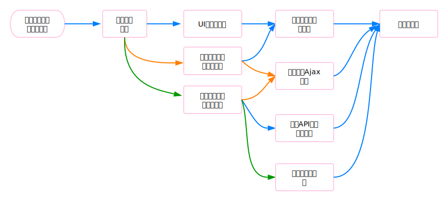

## 常见问题

### To Be Added

* 安全性／高性能／SEO／可维护性

#### 你在昨天/本周学到了什么？

* 昨天： 新入手Mac，配置常用App和编程环境，了解新手需要掌握的知识，熟悉快捷键（例如Chrome下的Vimium插件）
* 本周：暂时了解React16新特性，根据github学习代码简单实验
* 本周接下来需要：刷题以及尝试阅读React源码或者根据文档进行源码分析

---

#### 编写代码的哪些方面能够使你兴奋或感兴趣？

* 好玩，有趣，能够接触很多新的东西，拥抱变化
* 相对容易带来成就感，能够快速成长
* 能够进行创造与拥有很多的想法，To Be Creative

---

#### 你最近遇到过什么技术挑战？你是如何解决的？

上个月建立一个从UI设计、前端与后端都独立实现的[网站](http://47.95.220.98:5000/)遇到的挑战：

UI设计：可选的很多，但是网站的交互最适合哪种UI需要斟酌，必须要使用户有良好的体验，另外需要对移动端进行简单的适配。对UI设计不太了解，一开始动手码代码就经历了几次UI框架的变动，因为想法一直在变。

所以干脆花了两周学习UI设计，用PS画板制作了主页／个人页面／新建页面／产品页面／登录页面／注册页面，在实现前端页面时，通过Zeplin来查看设计的页面样式，将自己从设计的角色中抽离出来，除非有不合理，否则尊从之前的设计，快刀斩乱麻。

且不论UI设计得多完美，这样最起码对于样式的确定会比较迅速，就不需要由于太多的不确定性而摇摆不定。

这也说明：分工和协作的必要性，如果你的工作内容需要依赖其他内容，而你对其他内容并不熟悉，如果不能快速确定方案，事实上是比较耽误时间的。另外确定方案后，尊重协作者的方案（当然你可以发表意见）。

后端实现的难点：

由于该网站是基于FCC的一个后端项目，Demo网站是通过引入第三方登录（Twitter）来进行用户认证和管理。由于我对用户认证和后端处理这一块不太熟悉，在github上找了几个模板，但都不太理解，或者要么只有一端的方案（前端或者后端）要么代码比较旧，毕竟前端的更新日新月异。所以干脆买了Udemy的React全栈课程，虽然最后由于国内用twitter或者facebook第三方登录不符合国情，然后想使用微信第三方发现需要企业资质，最后采用了用户密码的方案。

总结：其实该难点在于完全不了解一个要点时如何着手，先学习较为详细的Demo，无疑花钱的课程最为详细和清晰。在有一个大致的认知后，再通过搜索引擎去解决问题。

---

#### 在制作一个网页应用或网站的过程中，你是如何考虑其 UI、安全性、高性能、SEO、可维护性以及技术因素的？

UI：一方面考虑美观，一方面着重考虑交互体验；比如[VotingApp](http://47.95.220.98:5000/)的网站中采用了扁平设计（考虑美观），交互上面比如给予用户反馈，登录注册类的提醒，新建Poll时的预览，数据的可视化等等

安全性：前端安全与后端安全。前端包括表单验证，string类型数据提交，用户数据不进行明文传输，也不要放在url后提交；后端安全包括数据验证和转换，合理的API设计，尽量使用https等。

前后端都要防止XSS注入或者CSRF攻击。

高性能：

目前对于我比较陌生，需要攻克。

能想到的就是

css方面：使用雪碧图优化样式图片加载时间；

前后端传输方面：服务端与客户断数据压缩传输；合理使用缓存；

构建方面：JS/CSS代码压缩与合并；图片base64编码；

代码方面：合理的交互与代码设计；js脚本中页面末尾加载；这方面了解最少

SEO：

了解较少，目前只知道中`<head>`元素内一些meta标签的使用

另外，服务端渲染的网页对SEO更为友好些，本人博客对于服务端渲染和客户端渲染进行过简单的[总结](http://guoxiaoyang.xyz/2017/09/10/Client_VS_ServerRouting/)

可维护性：

良好的代码习惯（注释、静态类型、一致的团队代码风格），模块化编程，较完备的测试，环境配置（考虑使用Docker），完善的技术文档等

技术因素：
小厂偏向轻便、快捷，使用成熟的框架，快速迭代；

大厂自建轮子，系统比较大时要使用稳健的架构；

个人偏向React-Node技术栈

---

#### 请谈谈你喜欢的开发环境。

编辑器当然是 VS Code啦，用过Sublime和Webstorm，感觉这货是两者的结合，方便的命令面板和配置、漂亮的UI，颜值控一眼就看上了。

前端框架目前一直都是使用React，因为基本只会这个。有过使用Angular 1的体验，但是没有什么感觉，后续应该要接触下React-Native和Vue。后端当然是Node-Express-MongoDB，没什么可说的。

开发与部署流程：比较喜欢的Creat-React-App脚手架，比我自己搭的稳定多了，功能也比较齐全。

---

#### 你最熟悉哪一套版本控制系统？

之前在公司用过Tortoise SVN，但我感觉更偏向文件版本管理，因为上传的几乎都是文档。

现在一直用Git。

---

#### 你能描述当你制作一个网页的工作流程吗？

如果是独立开发，其实这段时间都算啦。

画个流程图吧

* 确定网站内容与用户群体：首先明确网站的具体内容，是博客、电商类、视频网站还是App类，不同类型的网站当然适合不同的UI与架构；用户群体就是产品的定位了，这部分主要还是与UI和交互相关性比较多，可能这部分的工作主要在于产品；
* 确定网站架构：架构设计我还没有参与过，就我个人的经验，应该是大致确定网站的整体设计吧，根据网站类型与用户量确定大概的前后端技术和UI类型，这应该是技术总监干的活吧；
* 确定架构后不同团队就可以各自进行准备和开发了：UI与交互设计；前端技术选型与架构设计；后端技术选型与架构设计；
* 个人感觉UI要先行一步，毕竟确定了UI，前端才能切页面与交互。。当然前端也要根据后端API来实现后端数据获取与交互；另外后端还要部署相应的服务器环境、网站ip与域名、如果有分布式还需要分布式开发；当然数据库这块我也归到后端了；
* 测试及维护：这应该是前后端都要进行的工作，而且包括前后端联调和端到端测试啦。

这部分的内容都是我自己摸索出来写的，当然涉及到复杂的网站架构，还包括后端算法，甚至各部门层层转发的，以我目前的经验还不是很了解；如果有问题，欢迎指出。

当然上部分我可能更多的偏向于整个网站或者产品的开发流程了。事实上单指网页开发，我的理解是：

网站基础逻辑与架构->原型／草图设计->开发，HTML／CSS/JavaScript（这三部分的顺序应该主要还是先内容、样式、布局后交互，当然会有交叉）->测试及修改Bug

---

#### 假若你有 5 个不同的样式文件 (stylesheets), 整合进网站的最好方式是?

如果大多数页面都需要这5个样式，我会尽可能进行样式的重构并且进行合并与压缩，尽量减少http请求，优化页面加载时间。

如果不同的页面需要不同的样式，那就按照页面的需求设计合适的CSS模块，按需加载。

---

#### 你能描述渐进增强 (progressive enhancement) 和优雅降级 (graceful degradation) 之间的不同吗?

