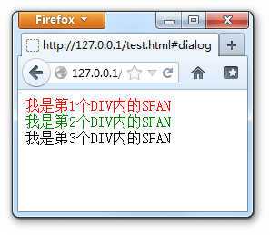

## HTML相关问题

#### doctype(文档类型) 的作用是什么？举例常见doctype及特点

声明文档类型，比如HTML或者XHTML；DOCTYPE声明告诉类似的代码校验器或者浏览器应该按照什么规则集解析文档，这些“规则”就是W3C发表的文档类型定义（DTD）中包含的规则<sup><a href="http://www.jianshu.com/p/c3dcdad42e6d">1</a></sup>。

#### 浏览器标准模式 (standards mode) 、几乎标准模式（almost standards mode）和怪异模式 (quirks mode) 之间的区别是什么？

由于常用Chrome，所以总是在标准模式下。

模式是浏览器渲染页面使用的规则，由DOCTYPE指定。当微软开始产生与标准兼容的浏览器时，他们希望确保向后兼容性。为了实现这一点，他们IE6.0以后的版本在浏览器内嵌了两种表现模式： Standards Mode（标准模式或Strict Mode）和Quirks mode（怪异模式或兼容模式Compatibility Mode）。在标准模式中，浏览器根据W3C所定的规范来显示页面；而在怪异模式中，页面将以IE5，甚至IE4的显示页面的方式来表现，以保持以前的网 页能正常显示。

怪异模式主要体现在盒模型与W3C标准非一致。

#### HTML 和 XHTML 有什么区别？

XHTML是XML的子集，相比HTML语法更为严格，比如元素一定要自闭合。总结<sup><a href="https://www.sitepoint.com/differences-html-xhtml/">2</a></sup>：

**HTML:**

> - 不严格要求有起始和结束标签.
> - 只有几个空元素才要求自闭合，如` br, img, link`
> - 标签和属性不区分大小写
> - 属性可以不用引号引用
> - 一些属性值可以为空，如`checked, disabled`
> - 一些特殊字符不用转义
> - 文档需要生命HTML5 DOCTYPE

**XHTML:**

> - 所有的元素要求起始标签
> - 非空有起始标签的元素必须包含结束标签
> - 所有的元素都要自闭合
> - 标签和属性区分大小写
> - 属性必须使用双引号
> - 属性不能有空值
> - 特殊字符需要转义

#### 如果页面使用 'application/xhtml+xml' 会有什么问题吗？

这个是真不清楚，所以做了个实验，我们用`Hello World`来看看到底会怎样。

```html
<!DOCTYPE html PUBLIC "-//W3C//DTD XHTML 1.0 Transitional//EN"
"http://www.w3.org/TR/xhtml1/DTD/xhtml1-transitional.dtd">
<html xmlns="http://www.w3.org/1999/xhtml">

<head>
  <title>Document</title>
</head>

<body>
  <p>Hello World!</p>
</body>

</html>
```


嗯，在Chrome与Safari下一切正常😓。参考W3C，主要在IE下会有问题：

浏览器在解析XML时会使用XML解析器。但是IE一直到IE8，都不支持XML，遇到XML时会显示下载对话框，而不是正常渲染，所以很多服务端返回XML时会使用text／html的MIME 类型。<sup><a href="https://neal.codes/blog/front-end-interview-questions-html#fn:3">3</a></sup>

---

#### iframe的优缺点

**优点：**

1. 解决加载缓慢的第三方内容如图标和广告等的加载问题
2. iframe无刷新文件上传
3. iframe跨域通信

**缺点：**

1. iframe会阻塞主页面的Onload事件
2. 无法被一些搜索引擎索引到
3. 页面会增加服务器的http请求
4. 会产生很多页面，不容易管理。

---

#### 如果网页内容需要支持多语言，你会怎么做？

使用utf-8编码，使用`lang`属性来表示网站语言或元素语言；服务端设置`Content-Language`。

之前用React-Intl时，需要在JS中先导入所需语言，然后配置翻译文件，按需加载。

#### 在设计和开发多语言网站时，有哪些问题你必须要考虑？

* 首先还是设计多语言的架构，如何将不同语言的内容套用到HTML内


* 当然是内容上的翻译，注意日期／时间／单复数／用词习惯／当地习俗
* 根据用户地阅读习惯适配网页，比如阅读方向／断句／字体等
* 最好用户可自行选择语言

---

#### 使用 `data- `属性的好处是什么？

使HTML能够存储自定义的数据，提供JS进行扩展操作。元素上的data属性在JS中可以用元素的dataset属性获取。

---

#### 如果把 HTML5 看作做一个开放平台，那它的构建模块有哪些？

考虑页面内容结构的话，HTML包含以下重要元素：

- `<article>`
- `<aside>`
- `<audio>`
- `<canvas>`
- `<figcaption>`
- `<figure>`
- `<footer>`
- `<header>`
- `<hgroup>`
- `<output>`
- `<section>`
- `<video>`

---

#### 请解释 `<script>`、`<script async>` 和` <script defer>` 的区别。

指定浏览器渲染页面时JS脚本的加载顺序。

* `<script>` 页面按顺序加载脚本，加载完成后继续加载其后的文档（阻塞式加载）
* `<script async>` 异步加载，与页面上其他内容一起加载，加载完成即执行；只对外部脚本有效
* ` <script defer>` 异步加载，但脚本延迟到文档完全被解析和显示之后再执行；只对外部脚本有效。不会影响页面的构造。

---

#### 为什么通常推荐将 CSS `<link> `放置在 `<head></head>` 之间，而将 JS `<script>` 放置在 `</body>` 之前？你知道有哪些例外吗？

* CSS放在`<head>`标签内是先加载css再加载文档，避免页面样式闪烁
* JS放在`</body>` 之前，是因为`<script>`是同步加载，会阻塞文档的渲染，且JS不应该在文档加载之前执行

---

#### 什么是渐进式渲染 (progressive rendering)？

这个没有用过。

顾名思义，就是不用等待内容全部下载完再渲染，而是下载一部分立即渲染该部分；包括图片的加载，可以先加载低分辨率再切换高分辨率。

总之，有内容>无内容，提升用户体验

---

#### 你用过哪些不同的 HTML 模板语言？

目前来说，只有过Node端使用[Pug](https://www.npmjs.com/package/pug)的体验


---

#### readonly与disabled区别

* readonly 和disable都会使表单元素不可编辑
* Readonly只针对input(text / password)和textarea有效，而disabled对于所有的表单元素都有效，包括select, radio, checkbox, button等。
* 表单元素在使用了disabled后，当我们将表单以POST或GET的方式提交的话，这个元素的值不会被传递出去，而readonly会将该值传递出去。

---

#### src与href区别

　　src用于替换当前元素，href用于在当前文档和引用资源之间确立联系。

　　src是source的缩写，指向外部资源的位置，指向的内容将会嵌入到文档中当前标签所在位置；在请求src资源时会将其指向的资源下载并应用到文档内，例如js脚本，img图片和frame等元素。

　　`<script src ="js.js"></script>`

　　当浏览器解析到该元素时，会暂停其他资源的下载和处理，直到将该资源加载、编译、执行完毕，图片和框架等元素也如此，类似于将所指向资源嵌入当前标签内。这也是为什么将js脚本放在底部而不是头部。

　　href是Hypertext Reference的缩写，指向网络资源所在位置，建立和当前元素（锚点）或当前文档（链接）之间的链接，如果我们在文档中添加

　　`<link href="common.css" rel="stylesheet"/>`

　　那么浏览器会识别该文档为css文件，就会并行下载资源并且不会停止对当前文档的处理。这也是为什么建议使用link方式来加载css，而不是使用@import方式。

---

#### ``的title和alt有什么区别

1. `title`是[global attributes](http://www.w3.org/TR/html-markup/global-attributes.html#common.attrs.core)之一，用于为元素提供附加的advisory information。通常当鼠标滑动到元素上的时候显示。
2. `alt`是``的特有属性，是图片内容的等价描述，用于图片无法加载时显示、读屏器阅读图片。可提图片高可访问性，除了纯装饰图片外都必须设置有意义的值，搜索引擎会重点分析。

---

#### HTML全局属性(global attribute)有哪些

- accesskey:设置快捷键，提供快速访问元素如aaa在windows下的firefox中按alt + shift + a可激活元素
- class:为元素设置类标识，多个类名用空格分开，CSS和javascript可通过class属性获取元素
- contenteditable: 指定元素内容是否可编辑
- contextmenu: 自定义鼠标右键弹出菜单内容
- data-*: 为元素增加自定义属性
- dir: 设置元素文本方向
- draggable: 设置元素是否可拖拽
- dropzone: 设置元素拖放类型： copy, move, link
- hidden: 表示一个元素是否与文档。样式上会导致元素不显示，但是不能用这个属性实现样式效果
- id: 元素id，文档内唯一
- lang: 元素内容的的语言
- spellcheck: 是否启动拼写和语法检查
- style: 行内css样式
- tabindex: 设置元素可以获得焦点，通过tab可以导航
- title: 元素相关的建议信息
- translate: 元素和子孙节点内容是否需要本地化

---

### 行内元素有哪些？块级元素有哪些？ 空(void)元素有那些？

CSS规范规定，每个元素都有`display`属性，确定该元素的类型，每个元素都有默认的`display`值，如`div`的`display`默认值为`block`，则为块级元素；span默认`display`属性值为`inline`，是行内元素。

  （1）行内元素有：`a b span img input select strong`
  （2）块级元素有：`div ul ol li dl dt dd h1 h2 h3 h4…p`

  （3）常见的空元素：
  	`<br> <hr>  <input> <link> <meta>`
  	鲜为人知的是：
  	`<area> <base> <col> <command> <embed> <keygen> <param> <source> <track> <wbr>`

---

#### 页面编码和被请求的资源编码如果不一致如何处理？

设置 `charset`

---

#### HTML生成公钥

```Html
<keygen name="name" challenge="challenge string" keytype="type" keyparams="pqg-params">
```

#### 改变html文本方向

```html
<!-- Switch text direction -->
<p><bdo dir="rtl">This text will go right to left.</bdo></p>
```

#### 高亮文本

```html
<p>Some part of this paragraph is <mark>highlighted</mark> by using mark element.</p>
```

#### 对局部html使用CSS属性

一直以来，文档上的STYLE元素通常都是作用域全局的，选择器按照全局的CSS优先规则来设置的。要实现局部的选择需要先选到容器元素，再用后代选择器来实现。scoped属性可以让STYLE元素不再作用于全局，而从当前STYLE元素所在的容器开始选择后代。
比如下面这个测试

```html
<div>
  <style scoped>
    span {color:red;}
  </style>
  <span>我是第1个DIV内的SPAN</span>
</div>
<div>
  <style scoped>
    span {color:green;}
  </style>
  <span>我是第2个DIV内的SPAN</span>
</div>
<div>
  <span>我是第3个DIV内的SPAN</span>
</div>
```




---

#### 下面HTML会触发http请求吗？

```html

```

会

```html
<div style="display: none;">
  
</div>
```

会

#### 加载顺序

```html
<head>
  <link href="style1.css" rel="stylesheet">
  <link href="style2.css" rel="stylesheet">
</head>
  
```

`style1.css`与`style2.css`并行加载，没有先后区别

```html
<head>
  <link href="style1.css" rel="stylesheet">
</head>
<body>
  <p>Paragraph 1</p>
  <p>Paragraph 2</p>
  <link href="style2.css" rel="stylesheet">
</body>
```

`style1.css在前，style2.css在后`

---

#### 你熟悉 SVG 样式的书写吗？

直接使用比较多，特别是矢量图标。大致看过MDN的文档<sup><a href="https://developer.mozilla.org/en-US/docs/Web/SVG">6</a></sup>，通过标签属性中的特定指令进行绘图，与canvas绘图方法差别较大。

#### 什么是 FOUC (无样式内容闪烁)？你如何来避免 FOUC？

浏览器在加载完DOM后如果继续加载样式(比如CSS中的`import`或者JS脚本中加载样式)，那么浏览器会先以默认样式呈现内容，然后渲染新的样式，总归是个容易分散用户注意力和显得不太专业的用户体验。

避免方式就是在`<head>`标签内尽量一次性引入样式文件。

#### 请解释什么是 ARIA 和屏幕阅读器 (screenreaders)，以及如何使网站实现无障碍访问 (accessible)。

老实说我了解得不多，对目前国内网页的无障碍实现情况真心没有接触过。Google搜索了一番也没有介绍国内网站对无障碍访问的支持力度，所以顺手在知乎上提出该[问题](https://www.zhihu.com/question/68265768?guide=1)。

> ARIA 是一个为残疾人士等提供无障碍访问动态、可交互 Web 内容的技术规范，为浏览器、媒体播放器、辅助技术的开发人员以及 Web 内容开发者定义了可以获得更广泛跨平台可访问性的方法。
>
> 屏幕阅读器是一种可将文字、图形以及电脑接口的其他部分（借文字转语音技术）转换成语音及/或点字的软件。

简单说下个人理解的一些常用方法来实现无障碍访问：

- 合理的HTML语义化，帮助屏幕阅读器进行转化


- 添加必要属性，比如`alt`属性，`role`属性


---

#### 参考资料

[^ 1]: http://www.jianshu.com/p/c3dcdad42e6d
[^2]: https://www.sitepoint.com/differences-html-xhtml/
[^3]: https://neal.codes/blog/front-end-interview-questions-html#fn:3
[^4]: https://github.com/johnpolacek/Front-end-Developer-Interview-Questions/blob/master/README.md