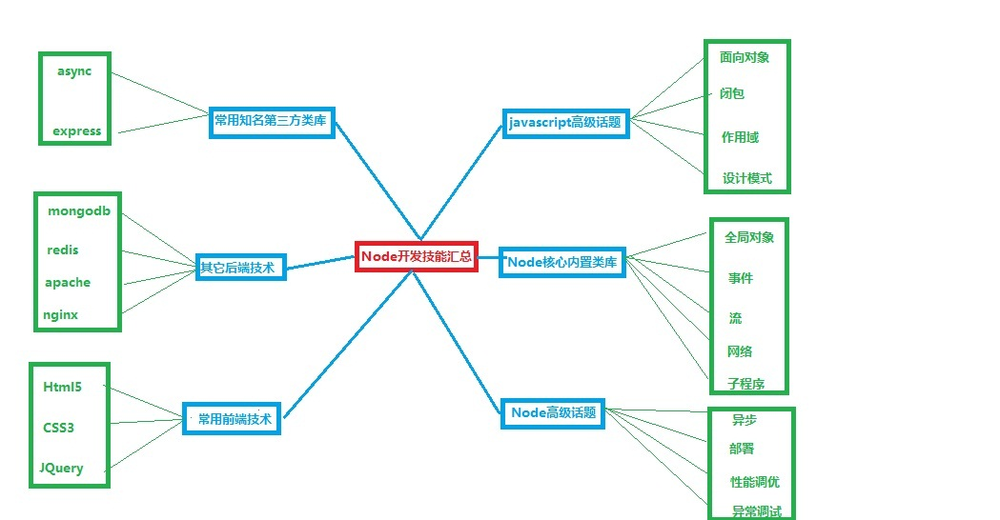
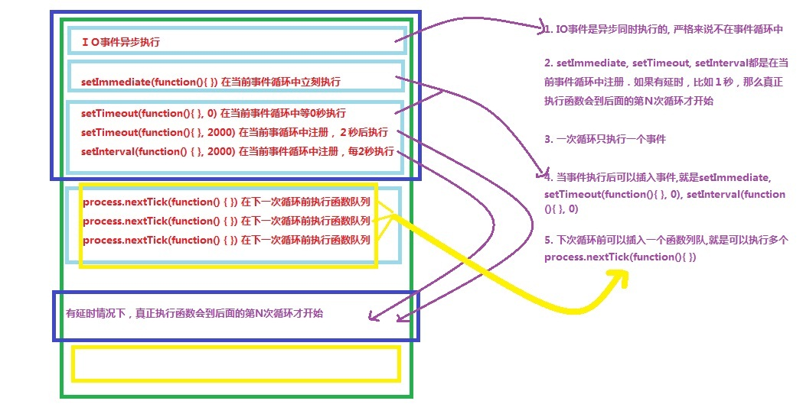

## Node.js相关问题

### 基础

#### 文章

- [ 类型判断](https://github.com/ElemeFE/node-interview/blob/master/sections/zh-cn/common.md#%E7%B1%BB%E5%9E%8B%E5%88%A4%E6%96%AD)
- [作用域](https://github.com/ElemeFE/node-interview/blob/master/sections/zh-cn/common.md#%E4%BD%9C%E7%94%A8%E5%9F%9F)
- [引用传递](https://github.com/ElemeFE/node-interview/blob/master/sections/zh-cn/common.md#%E5%BC%95%E7%94%A8%E4%BC%A0%E9%80%92)
- [内存释放](https://github.com/ElemeFE/node-interview/blob/master/sections/zh-cn/common.md#%E5%86%85%E5%AD%98%E9%87%8A%E6%94%BE)
- [ ES6 新特性](https://github.com/ElemeFE/node-interview/blob/master/sections/zh-cn/common.md#es6-%E6%96%B0%E7%89%B9%E6%80%A7)

#### js 中什么类型是引用传递, 什么类型是值传递? 如何将值类型的变量以引用的方式传递? [[more\]](https://github.com/ElemeFE/node-interview/blob/master/sections/zh-cn/common.md#q-value)

#### js 中， 0.1 + 0.2 === 0.3 是否为 true ? 在不知道浮点数位数时应该怎样判断两个浮点数之和与第三数是否相等？

#### const 定义的 Array 中间元素能否被修改? 如果可以, 那 const 修饰对象的意义是? [[more\]](https://github.com/ElemeFE/node-interview/blob/master/sections/zh-cn/common.md#q-const)

#### JavaScript 中不同类型以及不同环境下变量的内存都是何时释放? [[more\]](https://github.com/ElemeFE/node-interview/blob/master/sections/zh-cn/common.md#q-mem)

---

### Node框架

#### Node 开发技能图解



#### 为什么要用node?

参考答案: 总结起来node有以下几个特点：简单强大，轻量可扩展．简单体现在node使用的是javascript,json来进行编码，人人都会；强大体现在非阻塞IO,可以适应分块传输数据，较慢的网络环境，尤其擅长高并发访问；轻量体现在node本身既是代码，又是服务器，前后端使用统一语言;可扩展体现在可以轻松应对多实例，多服务器架构，同时有海量的第三方应用组件。

#### 谈谈Nodejs优缺点

> 优点：

1. 事件驱动，异步编程，占用内存少
2. npm设计得好

> 缺点：

1. Debug 很困难。没有 stack trace，出了问题很难查找问题的原因；
2. 如果设计不好，很容易让代码充满 callback，代码不优雅；
3. 可靠性低；
4. 单进程，单线程，只支持单核CPU，不能充分的利用多核CPU服务器。

#### node的构架是什么样子的?

参考答案: 主要分为三层，应用app >> V8及node内置架构 >> 操作系统. V8是node运行的环境，可以理解为node虚拟机．node内置架构又可分为三层: 核心模块(javascript实现) >> c++绑定 >> libuv + CAes + http.


#### node有哪些核心模块?

参考答案: EventEmitter, Stream, FS, Net和全局对象

#### node有哪些全局对象?

参考答案: process, console, Buffer和exports

#### process有哪些常用方法?

参考答案: process.stdin, process.stdout, process.stderr, process.on, process.env, process.argv, process.arch, process.platform, process.exit

#### console有哪些常用方法?

参考答案: console.log/console.info, console.error/console.warning, console.time/console.timeEnd, console.trace, console.table

#### node有哪些定时功能?

参考答案: setTimeout/clearTimeout, setInterval/clearInterval, setImmediate/clearImmediate, process.nextTick


#### ES6有哪些新特性？

参考答案：类的支持，模块化，箭头操作符，let/const块作用域，字符串模板，解构，参数默认值/不定参数/拓展参数,for-of遍历,generato r器, Map/Set, Promise

#### defineProperty, hasOwnProperty, isEnumerable都是做什么用的？

参考答案：`Object.defineProperty(obj, prop, descriptor)`用来给对象定义属性，有`value,writable,configurable,enumerable,set/get`等。`hasOwnProerty`用于检查某一属性是不是存在于对象本身，继承来的父亲的属性不算。`isEnumerable`用来检测某一属性是否可遍历，也就是能不能用for..in循环来取到。

---

### 事件／异步

#### 文章

- [`[Basic\]` Promise](https://github.com/ElemeFE/node-interview/blob/master/sections/zh-cn/event-async.md#promise)
- [`[Doc\]` Events (事件)](https://github.com/ElemeFE/node-interview/blob/master/sections/zh-cn/event-async.md#events)
- [`[Doc\]` Timers (定时器)](https://github.com/ElemeFE/node-interview/blob/master/sections/zh-cn/event-async.md#timers)
- [`[Point\]` 阻塞/异步](https://github.com/ElemeFE/node-interview/blob/master/sections/zh-cn/event-async.md#%E9%98%BB%E5%A1%9E%E5%BC%82%E6%AD%A5)
- [`[Point\]` 并行/并发](https://github.com/ElemeFE/node-interview/blob/master/sections/zh-cn/event-async.md#%E5%B9%B6%E8%A1%8C%E5%B9%B6%E5%8F%91)

#### Node的事件循环机制

event loop其实就是一个事件队列，先加入先执行，执行完一次队列，再次循环遍历看有没有新事件加入队列．但是请务必注意，这一个事件队列的循环，一次只执行一个事件，然后下一次循环再执行一个事件．这是由于javascript的单线程机制导致的，如果一次循环多个事件，就可能会阻塞其它代码的执行．异步执行的叫IO events, setImmediate是在当前队列立即执行,setTimout/setInterval是把执行定时到到后面的队列，process.nextTick是在当前执行完，下次遍历前执行．所以总体顺序是: IO events >> setImmediate >> setTimeout/setInterval(注册事件) >> process.nextTick.




浏览器中, js引擎线程会循环从 任务队列 中读取事件并且执行, 这种运行机制称作 Event Loop (事件循环).

每个浏览器环境，至多有一个event loop。 一个event loop可以有1个或多个task queue(任务队列)

先执行同步的代码，然后js会跑去消息队列中执行异步的代码，异步完成后，再轮到回调函数，然后是去下个事件循环中执行setTimeout

它从script(整体代码)开始第一次循环。之后全局上下文进入函数调用栈。直到调用栈清空(只剩全局)，然后执行所有的micro-task。当所有可执行的micro-task执行完毕之后。循环再次从macro-task开始，找到其中一个任务队列执行完毕，然后再执行所有的micro-task，这样一直循环下去。

从规范上来讲，setTimeout有一个4ms的最短时间，也就是说不管你设定多少，反正最少都要间隔4ms才运行里面的回调。而Promise的异步没有这个问题。Promise所在的那个异步队列优先级要高一些 Promise是异步的，是指他的then()和catch()方法，Promise本身还是同步的 Promise的任务会在当前事件循环末尾中执行，而setTimeout中的任务是在下一次事件循环执行

```javascript
//依次输出 12354
setTimeout(function(){
  console.log(4)
  },0);
new Promise(function(resolve){
  console.log(1)
  for( var i=0 ; i<10000 ; i++ ){
    i===9999 && resolve()
  }
  console.log(2)
}).then(function(){
  console.log(5)
});
console.log(3);
```

#### Node.js是如何做到I/O的异步和非阻塞的呢

其实Node在底层访问I/O还是多线程的。Node可以借助livuv来来实现多线程。

如果我们非要让Node.js支持多线程，还是提倡使用官方的做法，利用libuv库来实现。

cluster可以用来让Node.js充分利用多核cpu的性能

#### Promise 中 .then 的第二参数与 .catch 有什么区别? [[more\]](https://github.com/ElemeFE/node-interview/blob/master/sections/zh-cn/event-async.md#q-1)

#### Eventemitter 的 emit 是同步还是异步? [[more\]](https://github.com/ElemeFE/node-interview/blob/master/sections/zh-cn/event-async.md#q-2)

#### 如何判断接口是否异步? 是否只要有回调函数就是异步? [[more\]](https://github.com/ElemeFE/node-interview/blob/master/sections/zh-cn/event-async.md#q-3)

#### nextTick, setTimeout 以及 setImmediate 三者有什么区别? [[more\]](https://github.com/ElemeFE/node-interview/blob/master/sections/zh-cn/event-async.md#q-4)

#### 如何实现一个 sleep 函数? [[more\]](https://github.com/ElemeFE/node-interview/blob/master/sections/zh-cn/event-async.md#q-5)

#### 如何实现一个异步的 reduce? (注:不是异步完了之后同步 reduce) [[more\]](https://github.com/ElemeFE/node-interview/blob/master/sections/zh-cn/event-async.md#q-6)

#### async，Promise，Generator函数，co函数库区别

`async...await`写法最简洁，最符合语义。async/await让异步代码看起来、表现起来更像同步代码，这正是其威力所在。async 函数就是 Generator 函数的语法糖，只不过async内置了自动执行器。async 函数就是将 Generator 函数的星号（*）替换成 async，将 yield 替换成 await

#### async函数优点

1） Generator 函数必须靠执行器，所以才有CO函数库，async函数自带执行器 2）更好的语义 3）更广的适用性。co函数库yield后面只能是Thunk函数或者Promise对象，await后面可以跟Promise对象和原始类型值（等同于同步操作）

Generator 函数：可以把它理解成一个函数的内部状态的遍历器，Generator重点在解决异步回调金字塔问题，巧妙的使用它可以写出看起来同步的代码。

#### co函数库

co可以说是给generator增加了promise实现。co是利用Generator的方式实现了`async/await`（co返回Promise对象，async也返回Promise对象，co内部的generator函数即async，yield相当于await）

co 函数库其实就是将两种自动执行器（Thunk 函数和 Promise 对象），包装成一个库。

co函数接收一个Generator生成器函数作为参数。执行co函数的时候，生成器函数内部的逻辑像async函数调用时一样被执行。不同之处只是这里的await变成了yield（产出）。

```javascript
co(function* () {
  var result = yield Promise.resolve(true);
  return result;
}).then(function (value) {
  console.log(value);
}, function (err) {
  console.error(err.stack);
});
```

Promise 是异步编程的一种解决方案，比传统的解决方案——回调函数和事件监听——更合理和更强大。 promise catch函数和then第二个函数参数：

```javascript
promise.catch();
// 等价于
promise.then(null, function(reason){});
```

有许多场景是异步的： 1.事件监听，如click，onload等事件 2.定时器 setTimeout和setInterval 3.ajax请求

js异步编程模型（es5）：

- 回调函数（callback）陷入回调地狱，解耦程度特别低
- 事件监听（Listener）JS 和浏览器提供的原生方法基本都是基于事件触发机制的
- 发布/订阅（观察者模式）把事件全部交给控制器管理，可以完全掌握事件被订阅的次数，以及订阅者的信息，管理起来特别方便。
- Promise 对象实现方式

async函数与Promise、Generator函数一样，是用来取代回调函数、解决异步操作的一种方法。它本质上是Generator函数的语法糖。 Promise，generator/yield，await/async 都是现在和未来 JS 解决异步的标准做法

#### node中的异步和同步怎么理解

参考答案: node是单线程的，异步是通过一次次的循环事件队列来实现的．同步则是说阻塞式的IO,这在高并发环境会是一个很大的性能问题，所以同步一般只在基础框架的启动时使用，用来加载配置文件，初始化程序什么的．

#### 有哪些方法可以进行异步流程的控制?

参考答案: 1) 多层嵌套回调 2)　为每一个回调写单独的函数，函数里边再回调 3) 用第三方框架比方async, q, promise等

---

### EventEmitter

EventEmitter是node中一个实现观察者模式的类，主要功能是监听和发射消息，用于处理多模块交互问题.

#### 如何实现一个EventEmitter?

参考答案: 主要分三步：定义一个子类，调用构造函数，继承EventEmitter

代码演示

```javascript
    var util = require('util');
    var EventEmitter = require('events').EventEmitter;

    function MyEmitter() {
        EventEmitter.call(this);
    } // 构造函数

    util.inherits(MyEmitter, EventEmitter); // 继承

    var em = new MyEmitter();
    em.on('hello', function(data) {
        console.log('收到事件hello的数据:', data);
    }); // 接收事件，并打印到控制台
    em.emit('hello', 'EventEmitter传递消息真方便!');

```

#### EventEmitter有哪些典型应用?

参考答案: 1) 模块间传递消息 2) 回调函数内外传递消息 3) 处理流数据，因为流是在EventEmitter基础上实现的. 4) 观察者模式发射触发机制相关应用

#### 怎么捕获EventEmitter的错误事件?

参考答案: 监听error事件即可．如果有多个EventEmitter,也可以用domain来统一处理错误事件.

代码演示

```javascript
    var domain = require('domain');
    var myDomain = domain.create();
    myDomain.on('error', function(err){
        console.log('domain接收到的错误事件:', err);
    }); // 接收事件并打印
    myDomain.run(function(){
        var emitter1 = new MyEmitter();
        emitter1.emit('error', '错误事件来自emitter1');
        emitter2 = new MyEmitter();
        emitter2.emit('error', '错误事件来自emitter2');
    });

```

#### EventEmitter中的newListenser事件有什么用处?

参考答案: newListener可以用来做事件机制的反射，特殊应用，事件管理等．当任何on事件添加到EventEmitter时，就会触发newListener事件，基于这种模式，我们可以做很多自定义处理.

代码演示

```
var emitter3 = new MyEmitter();
emitter3.on('newListener', function(name, listener) {
    console.log("新事件的名字:", name);
    console.log("新事件的代码:", listener);
    setTimeout(function(){ console.log("我是自定义延时处理机制"); }, 1000);
});
emitter3.on('hello', function(){
    console.log('hello　node');
});

```

------

### IO/Buffer／Stream

#### 文章

- [`[Doc\]` Buffer](https://github.com/ElemeFE/node-interview/blob/master/sections/zh-cn/io.md#buffer)
- [`[Doc\]` String Decoder (字符串解码)](https://github.com/ElemeFE/node-interview/blob/master/sections/zh-cn/io.md#string-decoder)
- [`[Doc\]` Stream (流)](https://github.com/ElemeFE/node-interview/blob/master/sections/zh-cn/io.md#stream)

#### node中的Buffer如何应用?

参考答案: Buffer是用来处理二进制数据的，比如图片，mp3,数据库文件等。Buffer支持各种编码解码，二进制字符串互转．

#### Buffer 一般用于处理什么数据? 其长度能否动态变化? [[more\]](https://github.com/ElemeFE/node-interview/blob/master/sections/zh-cn/io.md#buffer)


#### 什么是Stream？

参考答案: stream是基于事件EventEmitter的数据管理模式．由各种不同的抽象接口组成，主要包括可写，可读，可读写，可转换等几种类型．

#### Stream有什么好处?

参考答案: 非阻塞式数据处理提升效率，片断处理节省内存，管道处理方便可扩展等.

#### Stream有哪些典型应用?

参考答案: 文件，网络，数据转换，音频视频等.

#### Stream 的 highWaterMark 与 drain 事件是什么? 二者之间的关系是? [[more\]](https://github.com/ElemeFE/node-interview/blob/master/sections/zh-cn/io.md#%E7%BC%93%E5%86%B2%E5%8C%BA)

#### Stream 的 pipe 的作用是? 在 pipe 的过程中数据是引用传递还是拷贝传递? [[more\]](https://github.com/ElemeFE/node-interview/blob/master/sections/zh-cn/io.md#pipe)

#### 怎么捕获Stream的错误事件?

参考答案: 监听error事件，方法同EventEmitter.

#### 有哪些常用Stream,分别什么时候使用?

参考答案: Readable为可被读流，在作为输入数据源时使用；Writable为可被写流,在作为输出源时使用；Duplex为可读写流,它作为输出源接受被写入，同时又作为输入源被后面的流读出．Transform机制和Duplex一样，都是双向流，区别时Transfrom只需要实现一个函数_transfrom(chunk, encoding, callback);而Duplex需要分别实现_read(size)函数和_write(chunk, encoding, callback)函数.

#### 实现一个Writable Stream?

参考答案: 三步走:1)构造函数call Writable 2)　继承Writable 3) 实现_write(chunk, encoding, callback)函数

代码演示

```javascript
var Writable = require('stream').Writable;
var util = require('util');

function MyWritable(options) {
    Writable.call(this, options);
} // 构造函数
util.inherits(MyWritable, Writable); // 继承自Writable
MyWritable.prototype._write = function(chunk, encoding, callback) {
    console.log("被写入的数据是:", chunk.toString()); // 此处可对写入的数据进行处理
    callback();
};

process.stdin.pipe(new MyWritable()); // stdin作为输入源，MyWritable作为输出源

```

---

### IO／文件系统

#### 文章

- [`[Doc\]` Console (控制台)](https://github.com/ElemeFE/node-interview/blob/master/sections/zh-cn/io.md#console)
- [`[Doc\]` File System (文件系统)](https://github.com/ElemeFE/node-interview/blob/master/sections/zh-cn/io.md#file)
- [`[Doc\]` Readline](https://github.com/ElemeFE/node-interview/blob/master/sections/zh-cn/io.md#readline)
- [`[Doc\]` REPL](https://github.com/ElemeFE/node-interview/blob/master/sections/zh-cn/io.md#repl)

#### 内置的fs模块架构是什么样子的?

参考答案: fs模块主要由下面几部分组成: 1) POSIX文件Wrapper,对应于操作系统的原生文件操作 2) 文件流 fs.createReadStream和fs.createWriteStream 3) 同步文件读写,fs.readFileSync和fs.writeFileSync 4) 异步文件读写, fs.readFile和fs.writeFile

#### 读写一个文件有多少种方法?

参考答案: 总体来说有四种: 1) POSIX式低层读写 2) 流式读写 3) 同步文件读写 4) 异步文件读写

#### 怎么读取json配置文件?

参考答案: 主要有两种方式，第一种是利用node内置的require('data.json')机制，直接得到js对象; 第二种是读入文件入内容，然后用JSON.parse(content)转换成js对象．二者的区别是require机制情况下，如果多个模块都加载了同一个json文件，那么其中一个改变了js对象，其它跟着改变，这是由node模块的缓存机制造成的，只有一个js模块对象; 第二种方式则可以随意改变加载后的js变量，而且各模块互不影响，因为他们都是独立的，是多个js对象.

#### fs.watch和fs.watchFile有什么区别，怎么应用?

参考答案: 二者主要用来监听文件变动．fs.watch利用操作系统原生机制来监听，可能不适用网络文件系统; fs.watchFile则是定期检查文件状态变更，适用于网络文件系统，但是相比fs.watch有些慢，因为不是实时机制．

#### 什么是文件描述符? 输入流/输出流/错误流是什么? [[more\]](https://github.com/ElemeFE/node-interview/blob/master/sections/zh-cn/io.md#file)

#### console.log 是同步还是异步? 如何实现一个 console.log? [[more\]](https://github.com/ElemeFE/node-interview/blob/master/sections/zh-cn/io.md#console)

#### 如何同步的获取用户的输入? [[more\]](https://github.com/ElemeFE/node-interview/blob/master/sections/zh-cn/io.md#%E5%A6%82%E4%BD%95%E5%90%8C%E6%AD%A5%E7%9A%84%E8%8E%B7%E5%8F%96%E7%94%A8%E6%88%B7%E7%9A%84%E8%BE%93%E5%85%A5)

#### Readline 是如何实现的? (有思路即可) [[more\]](https://github.com/ElemeFE/node-interview/blob/master/sections/zh-cn/io.md#readline)


---

### 网络

#### node的网络模块架构是什么样子的?

参考答案: node全面支持各种网络服务器和客户端，包括tcp, http/https, tcp, udp, dns, tls/ssl等.

#### node是怎样支持https,tls的?

参考答案: 主要实现以下几个步骤即可: 1) openssl生成公钥私钥 2) 服务器或客户端使用https替代http 3) 服务器或客户端加载公钥私钥证书

#### 实现一个简单的http服务器?

参考答案: 经典又很没毛意义的一个题目．思路是加载http模块，创建服务器，监听端口.

代码演示

```javascript
var http = require('http'); // 加载http模块

http.createServer(function(req, res) {
  res.writeHead(200, {'Content-Type': 'text/html'}); // 200代表状态成功, 文档类型是给浏览器识别用的
  res.write('<meta charset="UTF-8"> <h1>我是标题啊！</h1> <font color="red">这么原生，初级的服务器，下辈子能用着吗?!</font>'); // 返回给客户端的html数据
  res.end(); // 结束输出流
}).listen(3000); // 绑定3ooo, 查看效果请访问 http://localhost:3000

```

---

### 进程

#### 文章

- [`[Doc\]` Process (进程)](https://github.com/ElemeFE/node-interview/blob/master/sections/zh-cn/process.md#process)
- [`[Doc\]` Child Processes (子进程)](https://github.com/ElemeFE/node-interview/blob/master/sections/zh-cn/process.md#child-process)
- [`[Doc\]` Cluster (集群)](https://github.com/ElemeFE/node-interview/blob/master/sections/zh-cn/process.md#cluster)
- [`[Basic\]` 进程间通信](https://github.com/ElemeFE/node-interview/blob/master/sections/zh-cn/process.md#%E8%BF%9B%E7%A8%8B%E9%97%B4%E9%80%9A%E4%BF%A1)
- [`[Basic\]` 守护进程](https://github.com/ElemeFE/node-interview/blob/master/sections/zh-cn/process.md#%E5%AE%88%E6%8A%A4%E8%BF%9B%E7%A8%8B)

#### 单线程优点

Node.js依托于v8引擎，都是以单线程为基础的。单线程资源占用小。单线程避免了传统PHP那样频繁创建、切换线程的开销，使执行速度更加迅速

#### 线程与进程的区别

一个程序至少有一个进程,一个进程至少有一个线程. 
线程的划分尺度小于进程，使得多线程程序的并发性高。 
另外，进程在执行过程中拥有独立的内存单元，而多个线程共享内存，从而极大地提高了程序的运行效率。 
线程在执行过程中与进程还是有区别的。每个独立的线程有一个程序运行的入口、顺序执行序列和程序的出口。但是线程不能够独立执行，必须依存在应用程序中，由应用程序提供多个线程执行控制。 
从逻辑角度来看，多线程的意义在于一个应用程序中，有多个执行部分可以同时执行。但操作系统并没有将多个线程看做多个独立的应用，来实现进程的调度和管理以及资源分配。这就是进程和线程的重要区别。

#### 进程的当前工作目录是什么? 有什么作用? [[more\]](https://github.com/ElemeFE/node-interview/blob/master/sections/zh-cn/process.md#q-cwd)

#### child_process.fork 与 POSIX 的 fork 有什么区别? [[more\]](https://github.com/ElemeFE/node-interview/blob/master/sections/zh-cn/process.md#q-fork)

#### 父进程或子进程的死亡是否会影响对方? 什么是孤儿进程? [[more\]](https://github.com/ElemeFE/node-interview/blob/master/sections/zh-cn/process.md#q-child)

#### cluster 是如何保证负载均衡的? [[more\]](https://github.com/ElemeFE/node-interview/blob/master/sections/zh-cn/process.md#how-it-works)

#### 什么是守护进程? 如何实现守护进程? [[more\]](https://github.com/ElemeFE/node-interview/blob/master/sections/zh-cn/process.md#%E5%AE%88%E6%8A%A4%E8%BF%9B%E7%A8%8B)

#### 为什么需要child-process?

参考答案: node是异步非阻塞的，这对高并发非常有效．可是我们还有其它一些常用需求，比如和操作系统shell命令交互，调用可执行文件，创建子进程进行阻塞式访问或高CPU计算等，child-process就是为满足这些需求而生的．child-process顾名思义，就是把node阻塞的工作交给子进程去做．

#### exec、execFile、spawn和fork都是做什么用的?

参考答案: exec可以用操作系统原生的方式执行各种命令，如管道 cat ab.txt | grep hello; execFile是执行一个文件; spawn是流式和操作系统进行交互; fork是两个node程序(javascript)之间时行交互.


#### 实现一个简单的命令行交互程序?

参考答案: 那就用spawn吧.

代码演示

```javascript
var cp = require('child_process');

var child = cp.spawn('echo', ['你好', "钩子"]); // 执行命令
child.stdout.pipe(process.stdout); // child.stdout是输入流，process.stdout是输出流
// 这句的意思是将子进程的输出作为当前程序的输入流，然后重定向到当前程序的标准输出，即控制台

```

#### 两个node程序之间怎样交互?

参考答案: 用`fork`嘛，上面讲过了。原理是子程序用`process.on, process.send`，父程序里用`child.on,child.send`进行交互.
代码演示

```javascript
1) fork-parent.js
var cp = require('child_process');
var child = cp.fork('./fork-child.js');
child.on('message', function(msg){
console.log('老爸从儿子接受到数据:', msg);
});
child.send('我是你爸爸，送关怀来了!');

2) fork-child.js
process.on('message', function(msg){
console.log("儿子从老爸接收到的数据:", msg);
process.send("我不要关怀，我要银民币！");
});

```

#### 怎样让一个js文件变得像linux命令一样可执行?

参考答案: 1) 在myCommand.js文件头部加入 #!/usr/bin/env node 2) chmod命令把js文件改为可执行即可 3) 进入文件目录，命令行输入myComand就是相当于node myComand.js了

#### child-process和process的stdin,stdout,stderror是一样的吗?

参考答案: 概念都是一样的，输入，输出，错误，都是流．区别是在父程序眼里，子程序的stdout是输入流，stdin是输出流．

---

### 模块

#### 文章

- [模块机制](https://github.com/ElemeFE/node-interview/blob/master/sections/zh-cn/module.md#%E6%A8%A1%E5%9D%97%E6%9C%BA%E5%88%B6)
- [ 热更新](https://github.com/ElemeFE/node-interview/blob/master/sections/zh-cn/module.md#%E7%83%AD%E6%9B%B4%E6%96%B0)
- [上下文](https://github.com/ElemeFE/node-interview/blob/master/sections/zh-cn/module.md#%E4%B8%8A%E4%B8%8B%E6%96%87)
- [包管理](https://github.com/ElemeFE/node-interview/blob/master/sections/zh-cn/module.md#%E5%8C%85%E7%AE%A1%E7%90%86)

#### exports`和`module.exports`区别

`exports` 是 `module.exports` 的一个引用 module.exports 初始值为一个空对象 {}，所以 exports 初始值也是 {} require 引用模块后，返回的是 module.exports 而不是 exports

#### a.js 和 b.js 两个文件互相 require 是否会死循环? 双方是否能导出变量? 如何从设计上避免这种问题? [[more\]](https://github.com/ElemeFE/node-interview/blob/master/sections/zh-cn/module.md#q-loop)

#### 如果 a.js require 了 b.js, 那么在 b 中定义全局变量 `t = 111` 能否在 a 中直接打印出来? [[more\]](https://github.com/ElemeFE/node-interview/blob/master/sections/zh-cn/module.md#q-global)

#### 如何在不重启 node 进程的情况下热更新一个 js/json 文件? 这个问题本身是否有问题? [[more\]](https://github.com/ElemeFE/node-interview/blob/master/sections/zh-cn/module.md#q-hot)

---

### 常用知名第三方类库(Async, Express等)

async都有哪些常用方法，分别是怎么用?

参考答案: async是一个js类库，它的目的是解决js中异常流程难以控制的问题．async不仅适用在node.js里，浏览器中也可以使用。

1. `async.parallel`并行执行完多个函数后，调用结束函数

```javascript
async.parallel([
  function(){ ... },
    function(){ ... }
    ], callback);
```

2. `async.series`串行执行完多个函数后，调用结束函数

```javascript
async.series([
  function(){ ... },
  function(){ ... }
]);
```

3. `async.waterfall`依次执行多个函数，后一个函数以前面函数的结果作为输入参数

```javascript
async.waterfall([
  function(callback) {
    callback(null, 'one', 'two');
  },
  function(arg1, arg2, callback) {
    // arg1 now equals 'one' and arg2 now equals 'two' 
    callback(null, 'three');
  },
  function(arg1, callback) {
    // arg1 now equals 'three' 
    callback(null, 'done');
  }
], function (err, result) {
  // result now equals 'done' 
});

```

4. `async.map`异步执行多个数组，返回结果数组

```javascript
async.map(['file1','file2','file3'], fs.stat, function(err, results){
  // results is now an array of stats for each file 
});

```

5. `async.filter`异步过滤多个数组，返回结果数组

```javascript
async.filter(['file1','file2','file3'], fs.exists, function(results){
  // results now equals an array of the existing files 
});

```


---

### Express

#### express项目的目录大致是什么样子的

参考答案: app.js, package.json, bin/www, public, routes, views.

#### express常用函数

参考答案: express.Router路由组件,app.get路由定向，app.configure配置，app.set设定参数,app.use使用中间件

#### express中如何获取路由的参数

参考答案: /users/:name使用req.params.name来获取; req.body.username则是获得表单传入参数username; express路由支持常用通配符 ?, +, *, and ()

#### express response有哪些常用方法

参考答案: res.download() 弹出文件下载
res.end() 结束response
res.json() 返回json
res.jsonp() 返回jsonp
res.redirect() 重定向请求
res.render() 渲染模板
res.send() 返回多种形式数据
res.sendFile 返回文件
res.sendStatus() 返回状态

### 

---

### 其他话题(正则，部署，性能调优，异常调试等)

#### 文章

- [`[Doc\]` URL](https://github.com/ElemeFE/node-interview/blob/master/sections/zh-cn/util.md#url)
- [`[Doc\]` Query Strings (查询字符串)](https://github.com/ElemeFE/node-interview/blob/master/sections/zh-cn/util.md#query-strings)
- [`[Doc\]` Utilities (实用函数)](https://github.com/ElemeFE/node-interview/blob/master/sections/zh-cn/util.md#util-1)
- [`[Basic\]` 正则表达式](https://github.com/ElemeFE/node-interview/blob/master/sections/zh-cn/util.md#%E6%AD%A3%E5%88%99%E8%A1%A8%E8%BE%BE%E5%BC%8F)


#### HTTP 如何通过 GET 方法 (URL) 传递 let arr = [1,2,3,4] 给服务器? [[more\]](https://github.com/ElemeFE/node-interview/blob/master/sections/zh-cn/util.md#get-param)

#### Node.js 中继承 (util.inherits) 的实现? [[more\]](https://github.com/ElemeFE/node-interview/blob/master/sections/zh-cn/util.md#utilinherits)

#### 如何递归获取某个文件夹下所有的文件名? [[more\]](https://github.com/ElemeFE/node-interview/blob/master/sections/zh-cn/util.md#q-traversal)

#### 什么是同构

同构(isomorphic/universal)就是使前后端运行同一套代码的意思，后端一般是指 NodeJS 环境。

#### 怎样绑定node程序到80端口?

参考答案: 多种方式 1) sudo 2) apache/nginx代理 3) 用操作系统的firewall iptables进行端口重定向

#### 有哪些方法可以让node程序遇到错误后自动重启?

参考答案: 1) runit 2) forever 3) nohup npm start &

#### 怎样充分利用多个CPU?

参考答案: 一个CPU运行一个node实例

#### 怎样调节node执行单元的内存大小?

参考答案: 用--max-old-space-size 和 --max-new-space-size 来设置 v8 使用内存的上限

#### 程序总是崩溃，怎样找出问题在哪里?

参考答案: 1) node --prof 查看哪些函数调用次数多 2) memwatch和heapdump获得内存快照进行对比，查找内存溢出

#### 有哪些常用方法可以防止程序崩溃?

参考答案: 1) try-catch-finally 2) EventEmitter/Stream error事件处理 3) domain统一控制 4) jshint静态检查 5) jasmine/mocha进行单元测试

#### 怎样调试node程序?

参考答案: node --debug app.js 和node-inspector

#### 如何判断当前脚本运行在浏览器还是node环境中

```
this === window ? 'browser' : 'node';
通过判断Global对象是否为window，如果不为window，当前脚本没有运行在浏览器中
```

---

### 参考

[^1]: https://sunebear.gitbooks.io/frontend-developer-interview-questions-and-answers/content/nodejsmd.html
[^2]: [Node.js 实践教程](https://github.com/ElemeFE/node-practice)
[^3]: []如何通过饿了么 Node.js 面试(https://github.com/ElemeFE/node-interview/tree/master/sections/zh-cn)

 

