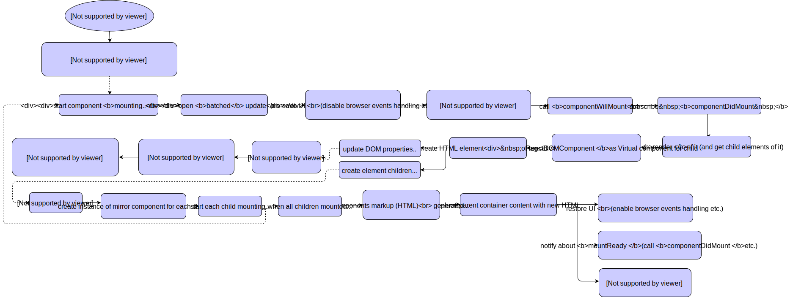
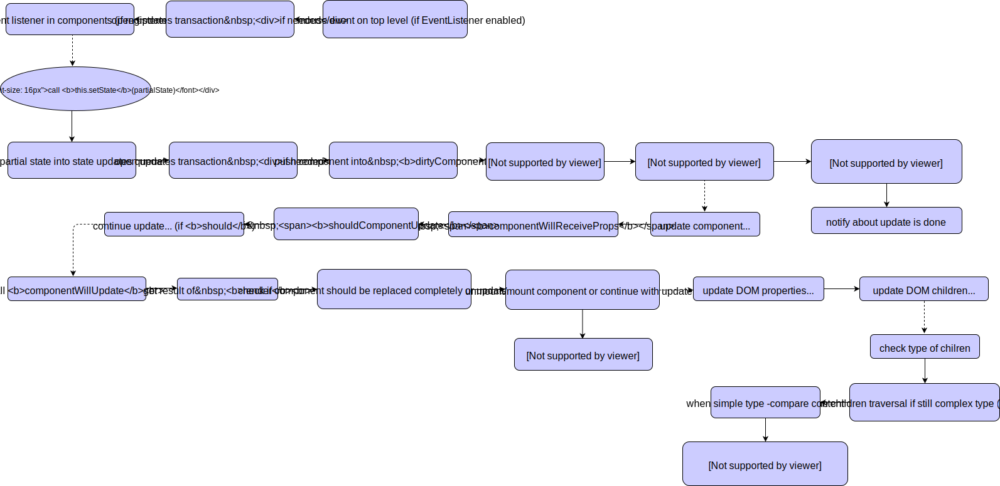

### React相关问题

#### 生命周期

初始加载过程<a href="https://github.com/Bogdan-Lyashenko/Under-the-hood-ReactJS">1</a>：

更新过程<a href="https://github.com/Bogdan-Lyashenko/Under-the-hood-ReactJS">1</a>：

卸载过程：`componentWillUnmount()`

catch error过程：

另一个简化版流程图<a href="https://zhuanlan.zhihu.com/p/28697362">2</a>：

---

#### 函数组件，组合组件与高阶组件分别是什么？

---

#### 受控组件是什么

---

#### 分析过源码吗？

---

#### 怎么优化React性能？

---

#### Redux是什么？

---

#### react-router 路由系统的实现原理？

---

#### React中如何解决第三方类库的问题?

---

#### recompose

---

#### Redux-Thunk vs Redux-Saga

---

#### React UI框架

---

[^1]: https://github.com/Bogdan-Lyashenko/Under-the-hood-ReactJS
[^2]: https://zhuanlan.zhihu.com/p/28697362
[^2]: https://github.com/lanjingling0510/blog/issues/1
[^3]: http://blog.csdn.net/u013510838/article/details/55669742
[^4]: https://github.com/Bogdan-Lyashenko/Under-the-hood-ReactJS
[^5]: https://bogdan-lyashenko.github.io/Under-the-hood-ReactJS/stack/languages/chinese/book/Intro.html